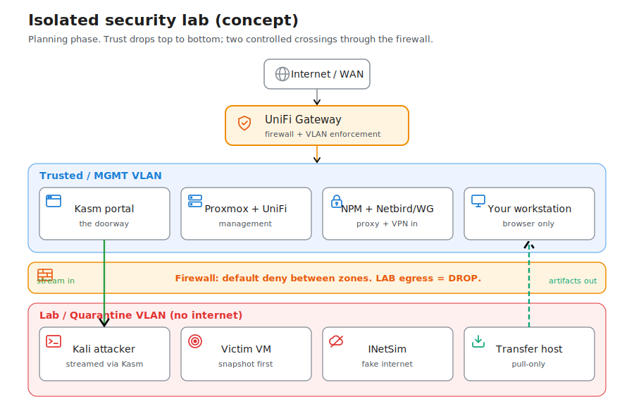

# Isolated Security Lab

**Created:** 2026-07-20  
**Last updated:** 2026-07-20

I want a network segment where I can detonate live malware & run offensive tooling with no path back to my LAN, my Proxmox management plane, or the internet. This record is the design & the decisions I still owe. Nothing is built yet: no VLAN, no guest, & no firewall rule exists as of 2026-07-20. When I build it, the command-level steps & the post-change tests go in a change record, & the new guests get added to the inventories under `Operations/Inventory/Galaxy/`.

## What the lab is for

Two jobs share one fenced VLAN, & they want opposite things from the network. Malware detonation needs zero reachability: the sample runs inside a snapshotted VM & talks only to a fake-internet box that answers every DNS query with itself. Pentest practice needs the attacker & the victim to reach each other on the same subnet, but nothing else.

I'll stream into the lab through Kasm instead of routing into it. Kasm runs on the management side & renders a Kali desktop, or a target's console, into my browser over 443. My workstation never gets a route onto the lab subnet, so there's no IP path from my daily machine to a lab guest.

## Containment rules

These five rules are the whole point. Every choice below serves one of them.

1. The lab never starts a connection outward: not to my LAN, not to the management VLAN, not to the internet.
2. Live samples detonate in a VM, never a container. A Kasm container shares the host kernel, so a kernel-level escape lands straight on the Kasm host.
3. I snapshot before every risky run & roll back after.
4. Only inspected artifacts leave: reports, PCAPs, hashes, IOCs. Live binaries stay in the lab vault, password-zipped.
5. My VPN & reverse proxy touch the doorway (Kasm, the Proxmox UI), never the room (the lab VLAN).

## Network

The lab gets its own VLAN, assigned from the [UniFi network segmentation plan](../Infrastructure/Network/UniFi/Documentation/Change%20Plans/Network-Segmentation-TODO.md) so it doesn't collide with the security segment on VLAN 72 or the NetBird-routed path on VLAN 85. The firewall runs default-deny with exactly two holes. Inbound, a single management host reaches the lab on the stream ports only: RDP 3389, VNC 5900-5901, & HTTPS 443, ideally scoped to the Kasm host IP. Outbound, a management host pulls from the transfer host on 22 or 445. Everything else drops, including LAB to the gateway & LAB to 8006 on the Proxmox nodes.

Two isolation grades cover the two jobs. The detonation net has no gateway IP at all: a Proxmox bridge with no uplink port, so there's nothing to route through even if a rule were wrong. The pentest net does have a gateway, but the UniFi policy drops all of its egress; it rides the existing trunk as a tagged VLAN. I may run them as two VLANs for a clean split, or fold them into one to cut firewall work. That's an open decision below.

## Machines on Galaxy

Every lab guest runs on the [Galaxy](../Infrastructure/Compute/Galaxy/README.md) Proxmox cluster. The Kali attacker is a VM with xrdp so Kasm can stream it, snapshotted as a known-good starting point. The victim is a VM I roll to a `base-clean` snapshot before each run: Metasploitable 2 or DVWA for pentest reps, a Windows 10/11 eval for real malware behavior. INetSim runs on a small Debian VM & answers DNS, HTTP, HTTPS, & SMTP so samples phone home into a sinkhole I can read. The transfer host is a tiny box exposing a pull-only SFTP or SMB share. The Kasm doorway itself lives on the management VLAN, sized 4 vCPU / 8 GB RAM / 50 GB to start.

## How I'll prove it's sealed

Config isn't proof; I test from inside a lab guest before anything live runs. Pings to 8.8.8.8, a LAN host, a Proxmox management IP, & the gateway must all fail. A web request must resolve to INetSim rather than the real site. Kali must reach the victim & nothing else. If any must-fail test passes, I stop & fix the firewall before a sample or an exploit touches the lab.

## Open decisions

- VLAN ID & subnet: pull the live UniFi VLAN list & pick an unused pair. My other segments use 10.x ranges, so a /24 in that space fits the pattern.
- Victim images: Metasploitable 2 is fast for pentest reps; a Windows eval is better for malware behavior. Probably both, on separate snapshots.
- Kali delivery: a VM streamed through Kasm is my default because the boundary is stronger. A Kasm-native Kali container on a macvlan is fewer machines but a weaker boundary. Leaning VM.
- One VLAN or two: a separate no-egress detonation net & controlled pentest net is cleaner; a single VLAN is less firewall work.

## Diagram

Each component carries a drawn icon. The editable source is `Diagrams/isolated-security-lab.excalidraw`; swap in exact brand logos there if I want them, then re-export the SVG.

## Related records

- [UniFi network segmentation plan](../Infrastructure/Network/UniFi/Documentation/Change%20Plans/Network-Segmentation-TODO.md): where the lab VLAN gets assigned & the firewall zones are defined.
- [Galaxy](../Infrastructure/Compute/Galaxy/README.md): the Proxmox cluster that hosts every lab guest.
- [Agent Sandbox](../Platforms/Agent%20Sandbox/Documentation/Agent%20Sandbox%20Plan.md): the on-demand sandbox my AI agents drive; its untrusted lane reuses this lab's no-egress containment rules.
- Kasm gets its own `Platforms/Kasm/` home once I deploy it. Until then the doorway design lives here.
