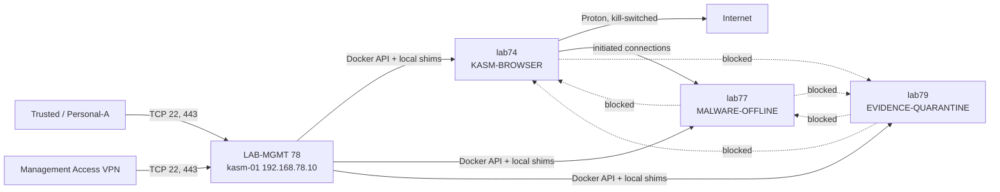

# Isolated Security Lab

**Created:** 2026-07-20  
**Last updated:** 2026-07-28

## Purpose

I run a fenced Kasm lab for suspicious browsing, Linux sample analysis, pentest practice, and artifact review. Kasm 1.19.0 Community Edition provides disposable Linux containers. Windows analysis and full detonation VMs are separate projects.

The lab has one control plane and three session lanes. The control plane is reachable from the two approved trusted networks. Its Management Access VPN policy permits the same path, but I still need one live remote client test. Session containers never join that management network.

## Current Topology

`kasm-01` is VM 122 on `purple-server`. Its 100 GiB disk lives on `ssd-lvm2`, the LVM-thin pool backed by Purple's Samsung 850 EVO. The control plane listens at `192.168.78.10` on LAB-MGMT VLAN 78.

VM 122 has three additional VLAN NICs with no host address:

| VLAN | Docker network | Container range | Purpose | Internet |
| ---: | --- | --- | --- | --- |
| 74 KASM-BROWSER | `lab74` | `192.168.74.208/28` | Browser sessions and pentest tooling | Proton only |
| 77 MALWARE-OFFLINE | `lab77` | `192.168.77.208/28` | Linux samples and disposable targets | None |
| 79 EVIDENCE-QUARANTINE | `lab79` | `192.168.79.208/28` | Artifact review | None |

Docker macvlan puts each session directly on its UniFi VLAN. Host shims at `.201/32` let the Kasm agent and proxy reach their own macvlan children without giving the parent NIC an address. The shim service starts before Docker and survived a full guest reboot.


```mermaid
flowchart LR
    T["Trusted / Personal-A"] -->|"TCP 22, 443"| M["LAB-MGMT 78<br/>kasm-01 192.168.78.10"]
    V["Management Access VPN"] -->|"TCP 22, 443"| M
    M -->|"Docker API + local shims"| B["lab74<br/>KASM-BROWSER"]
    M -->|"Docker API + local shims"| D["lab77<br/>MALWARE-OFFLINE"]
    M -->|"Docker API + local shims"| E["lab79<br/>EVIDENCE-QUARANTINE"]
    B -->|"Proton, kill-switched"| I["Internet"]
    B -->|"initiated connections"| D
    D -. blocked .-> B
    B -. blocked .-> E
    D -. blocked .-> E
    E -. blocked .-> B
    E -. blocked .-> D
```

## Boundary Model

The controls have separate jobs:

1. Kasm authenticates the user, enforces the session lifetime, and controls browser-mediated upload.
2. Docker macvlan assigns the selected session lane.
3. UniFi zones and explicit firewall rules contain every routed path.
4. Proton carries VLAN 74 Internet traffic while the VPN object remains enabled.
5. Proxmox keeps the whole lab workload on Purple and its replaceable SATA SSD.

A full container escape reaches `kasm-01`, so I treat the host as expendable. What makes that real rather than aspirational is the snapshot I take before a malware session and roll back to when it ends. Moving the control plane from SERVERS-A to LAB-MGMT keeps that escape away from production systems at the network layer. Purple remains a Galaxy cluster member, so a separate QEMU or Proxmox escape would still cross the cluster trust boundary. Current hypervisor patching and a narrow guest device surface remain necessary.

## Allowed Paths

Only these routed paths are intentional:

| Source | Destination | Scope |
| --- | --- | --- |
| Trusted and Personal-A | `192.168.78.10` | TCP 22 and 443 |
| Management Access VPN | `192.168.78.10` | TCP 22 and 443 allowed by policy; client test pending |
| LAB-MGMT | External | Resolver and image-pull traffic |
| KASM-BROWSER | External | Through `KASM Lab Proton Egress` |
| KASM-BROWSER | MALWARE-OFFLINE | Tooling may initiate toward a target |

MALWARE-OFFLINE cannot initiate back toward KASM-BROWSER. Neither active lane reaches EVIDENCE-QUARANTINE. Every session lane has an explicit block toward LAB-MGMT, Internal, Servers, Management, Access, and Observability.

The reverse-direction block from MALWARE-OFFLINE to KASM-BROWSER matches new and invalid connections. Established replies remain valid, so a tool on VLAN 74 can complete a connection it initiated to VLAN 77.

## DNS and Internet

The network selection and resolver selection are one configuration unit. Each Kasm workspace needs an explicit Docker Run Config Override:

```json
{"network":"lab74","dns":["9.9.9.9","149.112.112.112"]}
```

```json
{"network":"lab77","dns":["192.168.77.10"]}
```

```json
{"network":"lab79","dns":["192.168.79.10"]}
```

Nothing listens at `.77.10` or `.79.10`. Those choices make name resolution fail inside the sealed lane. Without the `dns` member, Docker injects its embedded `127.0.0.11` resolver and can forward lookups through LAB-MGMT, which breaks the offline promise.

VLAN 77 no longer advertises its stale DNS server through DHCP. INetSim is not part of the current design.

The Proton traffic route targets only KASM-BROWSER and has its kill switch enabled. I tested failure by leaving the VPN enabled and replacing its live endpoint with an unreachable TEST-NET address. VLAN 74 lost Internet while the Kasm host retained ordinary WAN. Administratively disabling the UniFi VPN object causes normal WAN fallback, so I keep the object enabled whenever a VLAN 74 session may run.

## Kasm Session Policy

The `Lab Sessions` group has a one-hour session limit. Browser-mediated uploads are enabled. Downloads, clipboard in both directions, seamless clipboard, and persistent profiles are disabled.

The persistent profile path stays empty. A lab workspace must not mount a host share. A workspace with no Docker network override runs on `kasm_default_network` and gains control-plane egress, so I treat a missing override as a failed workspace definition.

## Evidence Handling

Evidence review happens in a disposable VLAN 79 workspace. No other session lane can initiate toward it. Download to the user's workstation remains disabled at the group level.

This implementation does not include a retained evidence disk, automated hashing pipeline, shared filesystem, or KVM lifecycle. I will define those in a separate change if I need durable evidence handling.

## Acceptance Boundary

I completed the harmless-container acceptance run on 2026-07-28:

- VLAN 74 used Proton exit `185.98.168.20`.
- An enabled but failed Proton tunnel removed VLAN 74 Internet access.
- VLAN 77 and VLAN 79 had no working DNS or Internet.
- VLAN 74 could initiate toward VLAN 77, while VLAN 77 could not initiate back.
- No session lane reached LAB-MGMT, the trusted LAN, Proxmox management, cluster networking, application servers, access services, observability services, or the gateway UI.
- Trusted access to the Kasm health endpoint succeeded.
- Secure and service-zone access to Kasm TCP 443 failed.
- A reboot restored all NICs, shims, routes, and Docker networks. All eight Kasm service containers ran; seven reported Docker health `healthy`, `kasm_proxy` had no Docker health check, and the API health endpoint passed.
- Temporary containers, images, firewall rules, and test interfaces were absent after cleanup.

The exact targets and observed results are in the [2026-07-28 change record](../Platforms/Kasm%20Workspaces/Documentation/Change%20Records/Kasm%20Session%20Isolation%20-%202026-07-28.md).

## Operating Rules

- I keep the Proton VPN object enabled before and during VLAN 74 sessions.
- I publish no lab workspace without both the network and DNS override.
- I use browser-mediated upload only. I leave download, clipboard, persistent profiles, and host mounts disabled.
- I run no real sample until the current containment test still passes.
- I stop using the 850 EVO if its normalized wear indicator falls below 10 or any reallocated-sector, CRC, or uncorrectable-error counter becomes nonzero.

## Related Records

- [Kasm Session Isolation change](../Platforms/Kasm%20Workspaces/Documentation/Change%20Records/Kasm%20Session%20Isolation%20-%202026-07-28.md)
- [Kasm Workspaces deployment](../Platforms/Kasm%20Workspaces/Documentation/Deployment.md)
- [UniFi networks and VLANs](../Infrastructure/Network/UniFi/Configuration/VLANs/network-vlan.md)
- [UniFi firewall zones](../Infrastructure/Network/UniFi/Configuration/Zones/zone.md)
- [UniFi firewall policies](../Infrastructure/Network/UniFi/Configuration/Firewall/firewall.md)
