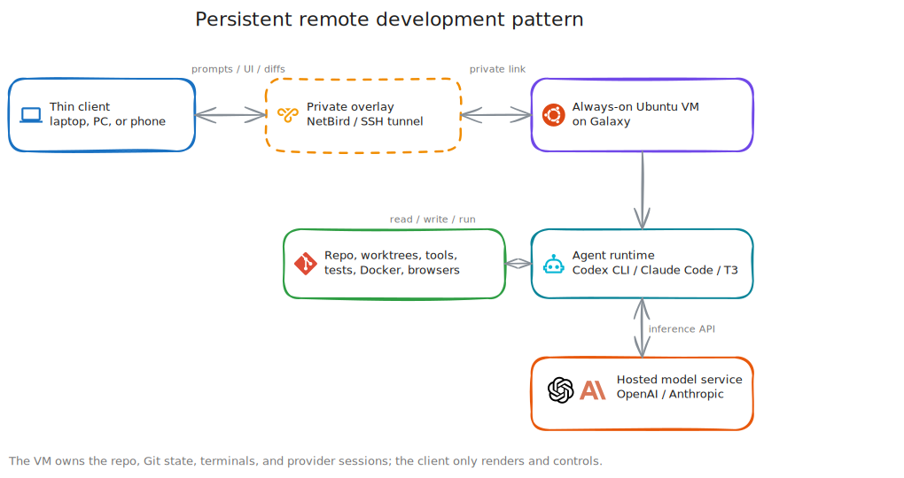

# Persistent Remote Development Research

**Created:** 2026-07-12  
**Last updated:** 2026-07-20

I wanted an always-on development machine without renting another VPS. The design I selected puts the repository, CLI tools, builds, tests, containers, & agent sessions on one Ubuntu VM in Galaxy; a laptop or phone supplies only the terminal, editor, or web interface.

Every product claim below points to one of the 13 sources under [Sources](#sources). Public demonstrations don't identify their underlying host hardware, so I don't use thread counts in a demo as proof of CPU or memory requirements.

## Selected Architecture

The remote machine stays powered on and owns the working state. It can be a VPS, homelab VM, or physical computer. I connect through SSH, a remote editor, or T3 Code; `tmux` or a service manager keeps processes alive when the client disconnects.

A Galaxy VM provides that same execution model without adding a public server. The material difference is reachability: I use NetBird or an SSH tunnel instead of publishing the development service to the internet.

## T3 Code Remote Model

T3 Code documents the arrangement I wanted [1][2]. A remote machine runs `npx t3 serve`; another device connects through its pairing flow. The remote host owns projects, files, Git state, terminals, & provider sessions, while the desktop application renders and controls them.

Its managed SSH path performs four operations: probe the host, start or reuse the T3 server, create a local port forward, & save the environment. T3 recommends a private mesh instead of a public listener. That establishes the supported topology, not the hardware behind any public demonstration.

## Execution Split

Installing Codex CLI on the VM makes the VM its execution environment. Codex reads, changes, & runs files in the selected remote directory. The native remote-TUI path follows the same split: `codex app-server` runs remotely and `codex --remote` connects from the client [3][4].

| Work | Execution location |
|---|---|
| Model inference & reasoning | OpenAI or Anthropic infrastructure unless I run a local model |
| Git, file changes, & dependency installation | Ubuntu VM |
| Type checking, compilation, tests, & Docker builds | Ubuntu VM |
| Development server & headless browser tests | Ubuntu VM |
| Terminal, T3 Code, or VS Code interface | Laptop or phone, with a server component on the VM |

More VM resources don't make a hosted model reason faster. They move repository indexing, package installation, builds, tests, containers, browser processes, & concurrent agent runtimes off the client device. Codex and Claude Code need no VM GPU when inference stays with the provider; local inference or a GPU-bound project changes that requirement.

Codex cloud uses a different boundary. OpenAI creates a managed container, checks out the repository, runs its setup, & executes the task in the background [5][6]. That covers repository-scoped work without giving me a persistent general-purpose VM.

## Three Persistence Layers

1. **Machine:** The powered-on VM keeps repositories, dependencies, & artifacts on its disk.
2. **Process:** `tmux`, T3 Code, or systemd keeps a running agent or development server alive after the client disconnects. The `tmux(1)` manual documents detach and reattach behavior [7].
3. **Conversation:** Codex saves its session history on the machine running the CLI and exposes that history through `codex resume` [8].

`tmux` survives a network loss, not a VM reboot. After reboot, systemd can restart enabled servers; Codex then resumes from its saved transcript. Persistence is three recoverable states, not one process that runs forever.

## Operation Options

### 1. SSH and tmux

I can connect through NetBird, open one `tmux` session per project, run Codex and test watchers in separate windows, then detach. This path requires SSH, `tmux`, & the chosen CLI. It also works from any client with a terminal.

### 2. T3 Code remote

The VM runs T3 Code plus the Codex or Claude CLI. A desktop application, browser, phone, or tablet controls the remote files, Git state, terminals, & sessions. The SSH-launched path keeps the backend on loopback and carries the UI connection through a local port forward [1][2].

### 3. Codex remote TUI

The VM runs `codex app-server`; the client reaches it through an SSH tunnel or authenticated `wss://` and starts `codex --remote` [4]. This removes T3 Code when a terminal UI is enough.

### 4. VS Code Remote SSH

VS Code keeps the visible editor on the client. Its server, terminal, extensions, debugger, & project run on the SSH host; the remote folder can also reopen inside a Dev Container [9].

### 5. Provider-hosted agents

Codex cloud and Claude Code on the web run repository tasks on provider-managed machines. They don't replace a durable VM that can host arbitrary services, local files, network tools, or long-running development servers.

## Terminal and Desktop Control

A headless agent can edit files, run shell commands, use Git, start servers, execute tests, & call configured tools. That covers the development work I need from Ubuntu Server.

Pixel-level control is separate. Anthropic documents computer use as screen capture plus keyboard and pointer control; its Claude Code CLI implementation is macOS-only, while the desktop implementation covers macOS and Windows [10]. A headless Ubuntu VM can test web interfaces with browser automation. Native Windows applications would require a separate Windows VM and desktop-control path.

## Galaxy VM Design

My proof of concept starts with 4 vCPU, 8 to 16 GiB RAM, & 80 to 150 GiB of SSD-backed storage. Those are starting allocations for web development, several agent processes, tests, & a few containers; Proxmox metrics decide whether I resize them.

I will apply the [Linux Host Baseline Standard](../Security/Hardening/Linux-Host-Baseline-Standard.md), enroll the VM as a NetBird peer, & allow only the developer-device group. SSH, T3 Code, & the Codex app server stay off public listeners. Each concurrent agent gets its own Git worktree and branch, while VM snapshots cover machine recovery and Git commits cover code history.

Ubuntu is the first target because SSH, `tmux`, systemd, containers, & the required development tools run natively. VS Code supports Windows SSH hosts and Codex runs on Windows, but I don't need a Windows VM until a project requires Windows builds or a native Windows application.

## Access Boundaries

- T3 recommends a private mesh. OpenAI recommends SSH forwarding for plain WebSockets and authentication plus TLS for non-local connections [1][4]. I won't publish an unauthenticated agent endpoint.
- Codex commands run inside an approval-gated sandbox; Claude Code separates tool permission from its operating-system filesystem and network sandbox [12][13]. I will keep the narrowest permissions that pass the test or build.
- Prompt injection remains possible when an agent reads untrusted content. The development VM won't receive Proxmox administration, unrestricted LAN shares, or production access.
- Parallel agents use separate worktrees. Tests and diff review run before merge or deployment, which limits one session to its own branch.

## Decision and Proof Test

I selected an Ubuntu VM with NetBird, SSH, `tmux`, & Codex CLI for the first phase. T3 Code comes after the terminal path survives disconnect, reconnect, build, test, & recovery checks. A Windows VM stays out of scope until one workload requires it.

The proof has five pass conditions:

1. A safe test task continues after the laptop disconnects.
2. Reconnecting restores the terminal and conversation.
3. Builds, tests, memory measurements, & browser automation run on the VM.
4. The service answers only through NetBird or an SSH tunnel.
5. A VM snapshot and Git branch recover a deliberately broken test change.

## Sources

1. [T3 Code documentation](https://github.com/pingdotgg/t3code/tree/main/docs) - `npx t3 serve`, pairing, private-mesh recommendation, SSH port forwarding, & remote state ownership
2. [T3 Code repository](https://github.com/pingdotgg/t3code) - web GUI for Codex & Claude
3. [Codex CLI](https://developers.openai.com/codex/cli) - terminal execution in the selected directory
4. [Codex CLI remote app server](https://developers.openai.com/codex/cli/features#connect-the-tui-to-a-remote-app-server) - `codex app-server`, `codex --remote`, SSH forwarding, & TLS requirements
5. [Codex cloud](https://developers.openai.com/codex/cloud) - managed background execution
6. [Codex cloud environments](https://developers.openai.com/codex/cloud/environments) - repository checkout & setup
7. [tmux(1) manual](https://man7.org/linux/man-pages/man1/tmux.1.html) - session detach & reattach behavior
8. [Codex CLI resume](https://developers.openai.com/codex/cli/features#resuming-conversations) - local transcripts & `codex resume`
9. [VS Code Remote SSH](https://code.visualstudio.com/docs/remote/ssh) - remote server, terminal, extensions, debugger, & Dev Containers
10. [Claude Code computer use](https://code.claude.com/docs/en/computer-use) - screen control and supported operating systems
11. [Codex authentication](https://developers.openai.com/codex/auth) - authentication behavior on the executing host
12. [Codex sandboxing](https://developers.openai.com/codex/concepts/sandboxing) - constrained execution & approvals
13. [Claude Code permissions](https://code.claude.com/docs/en/permissions) - tool permissions and operating-system sandboxing
