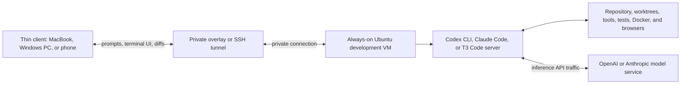

# Persistent Remote AI Development — Research

**Created:** 2026-07-12  
**Last updated:** 2026-07-12

## Short Answer

The pattern is a **development machine that stays on**—a cloud VPS, a homelab VM, or a small physical computer—with the repository, development tools, AI-agent CLI, credentials, and running processes on that machine. The developer connects from a laptop or phone through SSH, a remote editor, or a web/desktop control client. A terminal multiplexer such as `tmux`, or an agent server such as T3 Code, keeps the work available after the client disconnects.

A homelab Ubuntu VM can serve the same role as a rented VPS. The main difference is where the VM is hosted and how it is reached securely.

## What Is Confirmed About Theo/T3

The strongest primary-source evidence is the public T3 Code repository. T3 Code is a minimal web GUI for Codex and Claude, and its remote-access documentation describes the exact remote-development arrangement in question:

- A headless remote machine can run `npx t3 serve`; another device connects using a pairing link, token, or QR code.
- T3 recommends a trusted private mesh network such as a tailnet instead of exposing the server directly to the public internet.
- Its desktop-managed SSH flow probes the remote host, starts or reuses the remote T3 server, creates a local port forward, and saves the environment.
- In that SSH flow, the **remote host owns the T3 server, projects, files, Git state, terminals, and provider sessions**. The local desktop is the renderer and controller.

Source: [T3 Code `REMOTE.md`](https://github.com/pingdotgg/t3code/blob/main/REMOTE.md) and [T3 Code repository](https://github.com/pingdotgg/t3code).

This confirms that Theo's T3 project supports the architecture. It does **not**, by itself, prove that every workflow Theo has shown publicly runs on a rented VPS, identify his personal host provider, or establish the exact machine specifications he uses. Public demonstrations of many concurrent Codex threads show the workflow layer; they should not be treated as proof of a particular underlying host unless Theo states that directly.

## What Actually Runs Where

Installing Codex CLI on an Ubuntu VM makes that VM the CLI's execution environment. OpenAI describes Codex CLI as running from a terminal and reading, changing, and running code on the machine in the selected directory. Current Codex also supports a remote TUI arrangement: `codex app-server` can listen on the remote machine and a TUI on another machine can connect with `codex --remote`; OpenAI recommends SSH port forwarding for plain WebSockets and authentication plus TLS for non-local connections. Sources: [Codex CLI](https://developers.openai.com/codex/cli) and [Codex CLI features — remote app server](https://developers.openai.com/codex/cli/features#connect-the-tui-to-a-remote-app-server).

There are two separate kinds of compute:

| Work | Where it normally runs in this design |
|---|---|
| Model inference and reasoning | OpenAI/Anthropic infrastructure unless a local model is deliberately used |
| Git, file reads/writes, dependency installation | Remote VM |
| Type checking, compilation, tests, Docker builds | Remote VM |
| Development server and headless browser tests | Remote VM |
| Terminal or T3/VS Code user interface | Laptop or phone, with a small server component on the VM |

Therefore, a larger VM does not make the hosted model itself think faster. It does move the expensive local parts—repository indexing, package managers, builds, tests, containers, browser processes, and multiple agent harnesses—off a constrained MacBook Air. It can also remove most local application overhead if the laptop uses a terminal or browser as a thin client. No GPU is normally required for Codex or Claude Code using hosted models; a GPU becomes relevant only for local inference or GPU-dependent project workloads.

OpenAI's **Codex cloud** is a different offload model: OpenAI creates a managed container, checks out the repository, runs setup, and lets the agent work in the background. It is useful when no self-hosted persistent machine is required. Sources: [Codex cloud](https://developers.openai.com/codex/cloud) and [Codex cloud environments](https://developers.openai.com/codex/cloud/environments).

## Persistence Has Three Layers

1. **Machine persistence:** the VM remains powered on and its disk retains repositories, dependencies, credentials, and artifacts.
2. **Process persistence:** `tmux`, T3 Code's server, or another supervisor keeps a running agent or development server alive when SSH or the client disconnects. The `tmux` manual explicitly states that sessions survive SSH timeouts and intentional detach and can be reattached. Source: [`tmux(1)` manual](https://man7.org/linux/man-pages/man1/tmux.1.html).
3. **Conversation persistence:** the agent stores session history so it can be resumed. Codex stores transcripts locally and supports `codex resume`; the history lives on whichever machine is running the CLI. Source: [Codex CLI features — resuming conversations](https://developers.openai.com/codex/cli/features#resuming-conversations).

`tmux` survives a network disconnect, not a VM reboot. After a reboot, a service manager can restart long-lived servers, while agent conversations are resumed from their saved transcripts. This is why "persistent" should not be interpreted as one immortal model process.

## Common Ways to Operate It

### 1. SSH plus `tmux` — simplest and most portable

- Connect to the VM through a private overlay network.
- SSH into the VM.
- Start one `tmux` session per project or agent.
- Run `codex`, `claude`, development servers, and test watchers in separate windows or panes.
- Detach and later reattach from any device.

This is the underlying pattern behind many "AI coding from a phone" setups. It has few moving parts and works with almost any terminal-based agent.

### 2. T3 Code remote — closest match to Theo's current project

- Install and authenticate Codex or Claude on the VM.
- Run T3 Code headlessly on the VM, or let the desktop app launch it over SSH.
- Connect from T3 Code desktop, a browser, phone, or tablet.
- Keep files, Git operations, terminals, and agent-provider sessions on the VM.

The SSH-launched path is particularly attractive because it uses local port forwarding and keeps the remote backend on loopback rather than publishing it. Direct headless access should use the private overlay and the pairing controls described in T3's documentation.

### 3. Codex native remote TUI

- Run the Codex app server on the VM.
- Reach it through an SSH tunnel, or use authenticated `wss://` access.
- Run the Codex TUI on the client with `codex --remote`.

This removes the need for T3 Code when a terminal interface is sufficient. See [OpenAI's remote TUI instructions](https://developers.openai.com/codex/cli/features#connect-the-tui-to-a-remote-app-server).

### 4. VS Code Remote SSH

VS Code keeps the visible editor locally while the VS Code server, terminal, extensions, debugger, and project run on the remote host. Microsoft documents that new integrated terminals automatically run on the SSH host, and that a remote folder can also be reopened inside a Dev Container on that host. Source: [VS Code Remote SSH](https://code.visualstudio.com/docs/remote/ssh).

### 5. Provider-hosted agents

Codex cloud and Claude Code on the web already provide background, managed remote execution. They are convenient for repository-scoped tasks but are not the same as owning a durable general-purpose VM with arbitrary tools, services, network access, and files.

## Terminal Control Versus Full Computer Control

For coding, "the agent controls the machine" usually means it can read and edit files, run shell commands, use Git, start development servers, run tests, and call configured tools. That is sufficient for most remote development and works well on a headless Ubuntu VM.

Controlling a graphical desktop—seeing pixels, clicking buttons, and typing into arbitrary native applications—is a separate capability. It requires a desktop session plus a computer-use tool or automation harness. For example, Anthropic documents Claude Code computer use as actual screen and application control, but its CLI implementation is currently macOS-only; the Desktop version covers macOS and Windows. It also warns that computer use runs against the actual desktop rather than inside the Bash sandbox. Source: [Claude Code computer use](https://code.claude.com/docs/en/computer-use).

A headless Ubuntu coding VM should normally validate web interfaces with browser automation rather than a full remote desktop. Use a Windows VM only when the workload specifically needs Windows builds, native Windows applications, or Windows GUI testing. Full GUI control should be isolated from personal accounts and daily-driver desktops.

## Recommended Homelab Fit

The cleanest proof of concept for this workspace is a dedicated Ubuntu Server VM on Galaxy, not a new public VPS:

- Start around **4 vCPU, 8–16 GiB RAM, and 80–150 GiB SSD-backed storage** for web development, multiple agents, tests, and a few containers; resize from observed usage.
- Apply the [Linux Host Baseline Standard](../Security/Hardening/Linux-Host-Baseline-Standard.md) before adding the workload.
- Enroll the VM directly as a NetBird peer and restrict access to a specific developer-device group. The existing [NetBird platform](../Platforms/Netbird/README.md) already provides a verified remote overlay path, so it can fill the role that T3's documentation assigns to Tailscale.
- Permit SSH only through the private overlay. Do not create a public port-forward for SSH, T3 Code, or a Codex app server.
- Use an unprivileged development account without passwordless `sudo`.
- Keep each concurrent agent in a separate Git worktree and branch to prevent agents from editing the same checkout.
- Use VM snapshots or backups for machine recovery, but use Git commits and remote branches as the primary change history.
- Give the VM narrowly scoped repository credentials and no access to the Proxmox management plane, broad LAN shares, or unrelated secrets.

Ubuntu is the easiest first target because SSH, `tmux`, systemd, containers, and most development tooling are native. Native Windows is viable—VS Code Remote SSH supports Windows SSH hosts, and Codex runs on Windows—but WSL2 or an Ubuntu VM is generally simpler unless the project is Windows-specific.

## Security Boundaries That Matter

- **Private access first:** T3 recommends a trusted private mesh network. OpenAI recommends SSH forwarding for plain WebSockets and requires remote authentication plus TLS for non-local connections. Do not publish an unauthenticated agent endpoint.
- **Treat agent credentials as high value:** Codex can cache authentication on the executing host. Protect the development user's home directory, encrypt backups where appropriate, and never bake credentials into VM templates. Source: [Codex authentication](https://developers.openai.com/codex/auth).
- **Sandbox and limit approvals:** Codex commands run inside a constrained environment by default, with approvals governing boundary crossings. Claude Code similarly separates permissions from OS-level filesystem and network sandboxing. Sources: [Codex sandboxing](https://developers.openai.com/codex/concepts/sandboxing) and [Claude Code permissions](https://code.claude.com/docs/en/permissions).
- **Assume prompt injection is possible:** do not give an agent administrator credentials, unrestricted secret stores, or access to production systems merely because it runs on a dedicated VM.
- **Use worktrees and review gates:** isolate parallel agents, require tests, and review diffs before merge or deployment. Persistence increases both productivity and the time available for a bad autonomous action.

## Practical Recommendation

Start with **Ubuntu VM + NetBird + SSH + `tmux` + Codex CLI**. This proves remote execution, persistence, and resource offload with the smallest number of components. Once stable, add **T3 Code remote** for its phone/browser/desktop experience. Keep full desktop control out of the first phase; add a separate Windows VM later only if a real GUI-only requirement appears.

The first proof should demonstrate:

1. An agent continues a safe test task after the laptop disconnects.
2. Reconnecting restores the terminal and conversation context.
3. Builds, tests, memory use, and browser automation occur on the VM.
4. The service is reachable only through NetBird or an SSH tunnel.
5. A snapshot/backup and Git branch allow recovery from a bad agent action.

