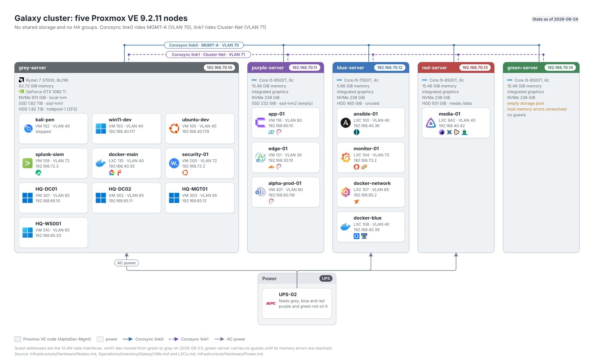

# Galaxy Proxmox Cluster Walkthrough

**Created:** 2026-07-20  
**Last updated:** 2026-08-14

## What This Guide Covers

Galaxy is a Proxmox VE cluster that runs five nodes today. I built it as four and added `green-server` on 2026-07-31. This walkthrough combines the original cluster join, the `red-server` expansion, the dedicated Corosync link on VLAN 71, Datacenter firewall objects, the `docker-network` LXC, & the Debian 13 development VM.

## Current Status and Verified Versions

All five nodes report `pve-manager/9.2.6`, kernel `7.0.14-8-pve`, & lowercase `.galaxy` FQDNs, checked against the cluster on 2026-08-03. Quorum holds at five votes. The API returned 19 guest records, 12 running; the workload inventory maps 13 guests. Corosync has `link0` on the management network & `link1` on `10.71.0.0/24`; the cluster stayed quorate when the second link was added. The versions recorded during the original four-node build were `pve-manager/9.2.2` and kernel `7.0.2-6-pve`.

VM 102 `debian-dev`, built in Step 6 below, was decommissioned on 2026-08-14 once `ubuntu-dev` (VM 105) took over as the machine I develop on. The step stays as a record of how the original guest was built; see [debian-dev Decommission - 2026-08-14](../Infrastructure/Compute/Galaxy/Documentation/Change%20Records/debian-dev%20Decommission%20-%202026-08-14.md) for its retirement.

## What You Need

- Four Proxmox nodes with matching package versions & working name resolution.
- A management network that already carries the initial Corosync traffic.
- A tagged VLAN for the second Corosync link; I used VLAN 71.
- Console access to each node before changing cluster networking.
- Current backups of `/etc/pve/corosync.conf`, `/etc/network/interfaces`, & the Datacenter firewall files.

## How the Pieces Fit Together



## Walkthrough

### Step 1: Verify the Starting Cluster

I checked package parity, node time, SSH reachability, quorum, & the current Corosync ring before changing a node.

```sh
pveversion -v
pvecm status
pvecm nodes
corosync-cfgtool -s
```

The starting view showed four online nodes using `link0`.


### Step 2: Join a New Node

I installed the same Proxmox release on the joining node, aligned `/etc/hosts`, authorized the joining root key on the founder, & opened the required cluster traffic before running `pvecm add <YOUR_FOUNDER_IP>` from the joiner.

I treated a successful join as incomplete until `pvecm nodes` listed the new node, quorum remained healthy, `/etc/pve/nodes/<YOUR_NEW_NODE>` existed, & the web UI showed the same member count.

### Step 3: Add the Dedicated Corosync Link

I created `vmbr0.71` on grey, purple, blue, & red with one address per node in `10.71.0.0/24`. I applied one node at a time, checked reachability to the other link addresses, then added `link1` to `corosync.conf` with a new `config_version`.


The completed cluster view showed both Corosync links.


### Step 4: Apply the Datacenter Firewall Objects

I kept management sources in the `pve_admins` IPSet & verified live SSH before, during, & after the restructure. The final test covered the current admin source, a permitted management source, & a source outside the set.

### Step 5: Build the Docker Network LXC

I created CT 107 `docker-network` on VLAN 85 with 2 vCPU, 4 GiB memory, a 32 GiB root disk, nesting, key-only SSH, Docker Engine 29.6.1, & Docker Compose 5.3.1. The guest became the shared host for Nginx Proxy Manager & NetBird.


### Step 6: Build the Debian Development VM

I installed Debian 13.6 with GNOME Shell 48.7 on VM 102, enabled the QEMU guest agent, installed the development packages, removed the duplicate APT source, & checked the desktop again after a controlled reboot.

## What I Checked After Each Step

- `pvecm status` remained quorate after every cluster change.
- `corosync-cfgtool -s` showed both rings.
- Management SSH stayed connected while firewall objects changed.
- CT 107 passed Docker, SSH, DNS, web, NTP, restart, & HA-state checks.
- VM 102 returned after reboot with GNOME, GDM, SSH, QEMU agent, & package sources healthy.

## Troubleshooting and Recovery

Stop if quorum drops, a node loses both management paths, or the edited `corosync.conf` fails to replicate. Restore the last versioned Corosync file from a quorate node. For one failed network change, use the node console to restore `/etc/network/interfaces` before touching another member.

## Known Limits

CT 107 uses node-local `local-lvm`, so its HA resource doesn't have shared-storage failover. The Debian development VM's fresh authenticated desktop-login check passed on 2026-07-22: Claude retained sign-in through GNOME Keyring and Cowork opened `/dev/kvm`.

## Source Records

- [Cluster setup](../Infrastructure/Compute/Galaxy/Documentation/Architecture/Galaxy%20Cluster%20Setup%20Document.md)
- [red-server expansion](../Infrastructure/Compute/Galaxy/Documentation/Change%20Records/Galaxy%20Cluster%20Red%20Server%20Expansion%20-%202026-07-07.md)
- [Corosync link1 change](../Infrastructure/Compute/Galaxy/Documentation/Change%20Records/Galaxy%20Cluster-Net%20Corosync%20Link%20Addition%20-%202026-07-10.md)
- [Docker network LXC](../Infrastructure/Compute/Galaxy/Documentation/Change%20Records/Galaxy%20Docker-Network%20LXC%20Deployment%20-%202026-07-10.md)
- [Debian development VM (archived; VM decommissioned 2026-08-14)](../Archive/Infrastructure/Compute/Galaxy/Documentation/Change%20Records/Galaxy%20Debian%20Dev%20GNOME%20Installation%20-%202026-07-15.md)
- [Post-staleness inventory](../Operations/Inventory/Galaxy/Galaxy%20Inventory%20Post-Staleness%20Audit%20-%202026-08-03.md)
