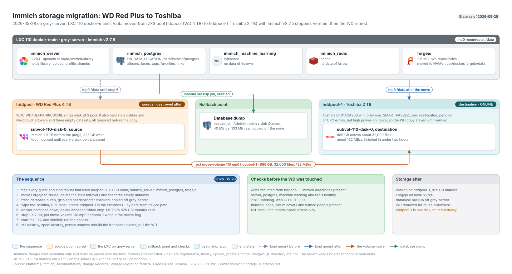

# Immich Storage Migration Walkthrough

**Created:** 2026-07-20  
**Last updated:** 2026-09-25

## What This Guide Covers

I moved Immich library storage from a WD-backed pool to a Toshiba-backed pool. The move ran on 2026-05-28. This walkthrough covers the capacity check, cleanup, database dump, pool work, stopped copy, verification, and old-drive retirement.

## Current Status and Verified Versions

On 2026-09-24 Immich server and machine learning ran v3.2.2 on CT 110 `docker-main` on `grey-server`, with the library still on ZFS pool `hddpool-1`. The migration ran under v2.7.5. It cut the dataset from about 1.9 TB to 825 GB and moved about 886 GB across 32,000 files.

## What You Need

- Console and shell access to the Proxmox node and Immich LXC.
- A destination disk with enough usable capacity for the reduced dataset and expected growth.
- A fresh Immich database dump, taken as the rollback point for this move.
- Enough downtime to stop the Immich Compose project and LXC during the volume move.
- The LXC mount-point name and source pool from your own deployment.

## How the Pieces Fit Together



## Walkthrough

### Step 1: Map Every Dependency on the Source Pool

I checked every guest configuration and Docker bind mount that referenced `hddpool`. LXC 110 mounted it as `/data`; Immich and Forgejo were the active consumers. Immich used `/data/immich/library` for uploads and `/data/immich/postgres` for PostgreSQL.

### Step 2: Move the Unrelated Workload

I stopped Forgejo, moved its 2.6 MB data directory from `/data/forgejo` to the LXC's local NVMe storage at `/opt/docker/forgejo/data`, changed its bind mount, and confirmed both repositories and HTTP 200 after restart. I also removed the empty Calibre, Nextcloud, and placeholder-dataset leftovers.

### Step 3: Dump the Database

I triggered a fresh database dump from Immich's Administration > Job Queues page. I checked gzip integrity, the PostgreSQL dump header and footer, the 40 MB compressed size, and the roughly 103 MB uncompressed size.

### Step 4: Prepare the New Pool

I wiped the Toshiba disk, initialized GPT, and created ZFS pool `hddpool-1` through the Proxmox UI. I used the persistent disk path, left Add Storage enabled, and confirmed the pool was ONLINE on the expected device.

### Step 5: Shrink Regenerable Data

The 2 TB Toshiba was smaller than the 4 TB WD. I stopped Immich with `docker compose down`, deleted only the contents of `/data/immich/library/encoded-video/`, and remeasured the dataset at about 825 GB. I kept the original media, uploads, profiles, thumbnails, and PostgreSQL data.

### Step 6: Move the LXC Volume

I stopped LXC 110 and used Proxmox's volume move without the delete flag. Proxmox copied the volume, updated `mp0` to the new pool, and kept the WD-backed subvolume available during verification.

```sh
pct move-volume 110 mp0 hddpool-1
```

The task moved roughly 886 GB across 32,000 files at about 132 MB/s and completed in under two hours.

### Step 7: Start and Verify Immich

I started LXC 110, confirmed `/data` came from `hddpool-1`, started Immich, and watched the server, PostgreSQL, machine-learning, and Redis containers become healthy. Port 2283 returned HTTP 200. In the UI, the timeline, album covers, named faces, full-resolution photos, and videos all worked.

### Step 8: Retire the Old Drive

Only after the application checks passed did I destroy the old subvolume, destroy `hddpool`, remove its Proxmox storage entry, rebuild the video transcode cache, and remove the WD drive.

```sh
zfs destroy hddpool/subvol-110-disk-0
zpool destroy hddpool
pvesm remove hddpool
```

## What I Checked After Each Step

- The Toshiba SMART result passed with zero reallocated, pending, or CRC-error counts.
- The new database dump passed gzip and PostgreSQL boundary checks.
- `hddpool-1` was ONLINE on the persistent Toshiba device path.
- Proxmox updated LXC 110 `mp0` to `hddpool-1` and retained the old subvolume.
- All four Immich containers became healthy and port 2283 returned HTTP 200.
- Albums, faces, photos, and videos remained intact before the WD pool was removed.

## Troubleshooting and Recovery

If the Proxmox task fails, leave LXC 110 stopped and inspect both ZFS pools before retrying. If Immich fails after the move, point `mp0` back to the retained source subvolume and check the mount before starting the Compose project. Don't destroy the old subvolume until the UI and container checks pass.

## Known Limits

The source record doesn't retain a terminal transcript or screenshots for the migration. `hddpool-1` is a single-disk pool with no redundancy, and the Toshiba already had high power-on hours and a high load-cycle count on 2026-05-28. A drive failure takes the library with it.

## Source Records

- [Immich storage migration record](../Platforms/Immich/Documentation/Change%20Records/Storage%20Migration%20from%20WD%20Red%20Plus%20to%20Toshiba%20-%202026-05-28.md)
