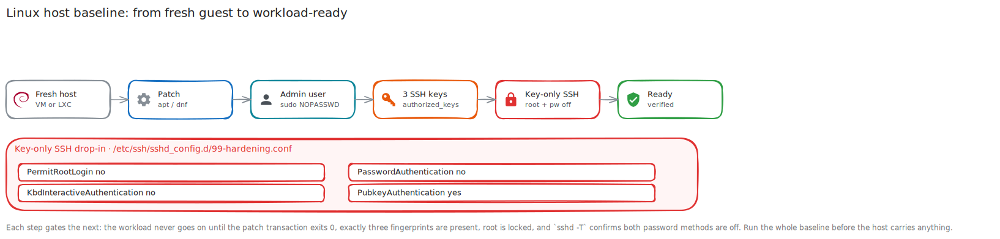

# Linux Host Baseline Walkthrough

**Created:** 2026-07-20  
**Last updated:** 2026-07-20

## What This Guide Covers

I apply this baseline to a Linux VM or LXC before it carries a workload. The finish line is a patched host with one administrative account, exactly three approved SSH public keys, key-only SSH, locked root, passwordless sudo for automation, & consistent time and locale.

## Current Status and Verified Versions

CT 107 `docker-network` is the recorded reference implementation. The same baseline was later applied to CT 842 `media-01`.

## What You Need

- Hypervisor console access.
- A hostname, address, gateway, DNS server, & time zone.
- Three public keys: `<YOUR_ADMIN_KEY_ONE_PUBLIC_KEY>`, `<YOUR_ADMIN_KEY_TWO_PUBLIC_KEY>`, & `<YOUR_ADMIN_KEY_THREE_PUBLIC_KEY>`.
- The intended administrative username, shown here as `<YOUR_ADMIN_USERNAME>`.

## How the Pieces Fit Together



## Walkthrough

### Step 1: Patch the Host

```sh
apt update
apt upgrade -y
```

On an RHEL-family host, use `dnf upgrade -y`. I don't install the workload until the package transaction exits `0`.

### Step 2: Create the Administrative Account

```sh
adduser <YOUR_ADMIN_USERNAME>
usermod -aG sudo <YOUR_ADMIN_USERNAME>
printf '<YOUR_ADMIN_USERNAME> ALL=(ALL:ALL) NOPASSWD: ALL\n' > /etc/sudoers.d/90-<YOUR_ADMIN_USERNAME>
chmod 0440 /etc/sudoers.d/90-<YOUR_ADMIN_USERNAME>
visudo -cf /etc/sudoers.d/90-<YOUR_ADMIN_USERNAME>
```

### Step 3: Install the Three Public Keys

Create `/home/<YOUR_ADMIN_USERNAME>/.ssh/authorized_keys` with one complete public key per line. Set the directory to `0700`, the file to `0600`, & both to `<YOUR_ADMIN_USERNAME>` ownership.

### Step 4: Disable Password and Root SSH

Write `/etc/ssh/sshd_config.d/99-hardening.conf`:

```text
PermitRootLogin no
PubkeyAuthentication yes
PasswordAuthentication no
KbdInteractiveAuthentication no
```

Run `sshd -t` before restarting SSH. Keep the console open until a second session connects with a public key.

### Step 5: Lock Root and Set Time

```sh
passwd -l root
timedatectl set-timezone America/New_York
```

Generate `en_US.UTF-8` & make it active through the distribution's locale tools.

## What I Checked After Each Step

```sh
id <YOUR_ADMIN_USERNAME>
sudo -n true
sudo sshd -T | grep -E 'permitrootlogin|pubkeyauthentication|passwordauthentication|kbdinteractiveauthentication'
ssh-keygen -lf /home/<YOUR_ADMIN_USERNAME>/.ssh/authorized_keys
passwd -S root
timedatectl
locale
```

The expected state is membership in `sudo`, non-interactive sudo exit `0`, three fingerprints, `permitrootlogin no`, both password methods disabled, & root status `L`.

## Troubleshooting and Recovery

If `sshd -t` fails, do not restart SSH. Fix the reported file & line from the console. If the second session can't connect, restore the previous drop-in while the first session remains open.

## Known Limits

Windows hosts follow separate records. A higher-risk Linux host can replace NOPASSWD with another privilege model, but its runbook must also replace the unattended Ansible & SSH Manager steps that depend on `sudo -n`.

## Source Records

- [Linux Host Baseline Standard](../Security/Hardening/Linux-Host-Baseline-Standard.md)
- [docker-network LXC deployment](../Infrastructure/Compute/Galaxy/Documentation/Change%20Records/Galaxy%20Docker-Network%20LXC%20Deployment%20-%202026-07-10.md)
- [Media Stack deployment](../Platforms/Media%20Stack/Documentation/Change%20Records/Media%20Stack%20Deployment%20-%202026-07-17.md)
