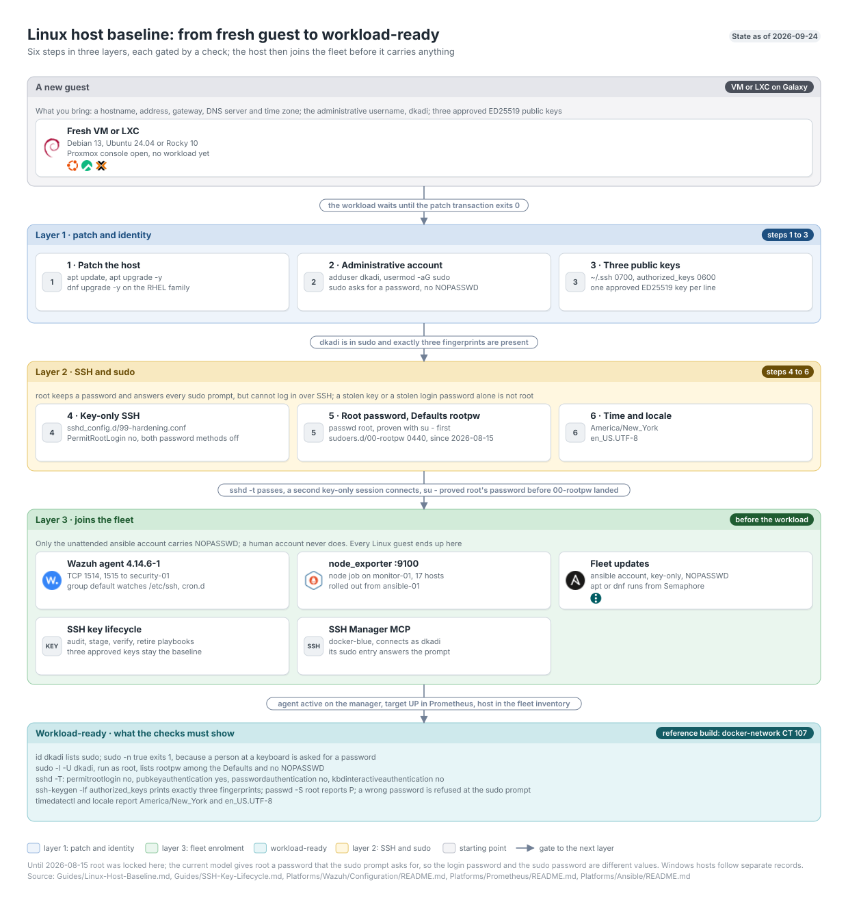

# Linux Host Baseline Walkthrough

**Created:** 2026-07-20  
**Last updated:** 2026-09-07

## What This Guide Covers

I apply this baseline to a Linux VM or LXC before it carries a workload. The finish line is a patched host with one administrative account, exactly three approved SSH public keys, key-only SSH, root that cannot log in over SSH, a sudo prompt that asks for a password other than the login password, passwordless sudo for automation only, & consistent time and locale.

## Current Status and Verified Versions

CT 107 `docker-network` is the recorded reference implementation. The same baseline was later applied to CT 842 `media-01`.

## What You Need

- Hypervisor console access.
- A hostname, address, gateway, DNS server, & time zone.
- Three public keys: `<REDACTED_ADMIN_KEY_ONE_PUBLIC_KEY>`, `<REDACTED_ADMIN_KEY_TWO_PUBLIC_KEY>`, & `<REDACTED_ADMIN_KEY_THREE_PUBLIC_KEY>`.
- The intended administrative username, shown here as `dkadi`.

## How the Pieces Fit Together



## Walkthrough

### Step 1: Patch the Host

```sh
apt update
apt upgrade -y
```

On an RHEL-family host, use `dnf upgrade -y`. I don't install the workload until the package transaction exits `0`.

### Step 2: Create the Administrative Account

```sh
adduser dkadi
usermod -aG sudo dkadi
```

Group membership is the whole policy. `%sudo ALL=(ALL:ALL) ALL` already ships in `/etc/sudoers`, so `dkadi` gets sudo and is asked for a password. Step 5 makes that password root's rather than its own. I don't write a `NOPASSWD` drop-in for a human account: the reason automation needs one is that it runs unattended, and a person at a keyboard doesn't. It also means a stolen key alone is not root.

### Step 3: Install the Three Public Keys

Create `/home/dkadi/.ssh/authorized_keys` with one complete public key per line. Set the directory to `0700`, the file to `0600`, & both to `dkadi` ownership.

### Step 4: Disable Password and Root SSH

Write `/etc/ssh/sshd_config.d/99-hardening.conf`:

```text
PermitRootLogin no
PubkeyAuthentication yes
PasswordAuthentication no
KbdInteractiveAuthentication no
```

Run `sshd -t` before restarting SSH. Keep the console open until a second session connects with a public key.

### Step 5: Give Root a Password and Point Sudo at It

Set root's password with `passwd root`, then prove it authenticates with `su -` from an unprivileged account before going further. Then write `/etc/sudoers.d/00-rootpw`, mode `0440`, validated with `visudo -cf` at a temporary path first:

```text
Defaults rootpw
```

A sudo prompt on the host now asks for root's password instead of the invoking user's. Stock sudo cannot separate the two, so this is the only way a stolen login password stays short of root. The order matters: if root's password is locked or unknown when that file lands, every account loses sudo at once and the way back is the hypervisor console. Root still cannot log in over SSH, because Step 4 turned that off.

I used to lock root here. That ended on 2026-08-15, when I moved to this model.

### Step 6: Set Time and Locale

```sh
timedatectl set-timezone America/New_York
```

Generate `en_US.UTF-8` & make it active through the distribution's locale tools.

## What I Checked After Each Step

```sh
id dkadi
sudo -n true; echo "expect exit 1: $?"
sudo -l -U dkadi   # as root: expect rootpw among the Defaults and no NOPASSWD
sudo sshd -T | grep -E 'permitrootlogin|pubkeyauthentication|passwordauthentication|kbdinteractiveauthentication'
ssh-keygen -lf /home/dkadi/.ssh/authorized_keys
passwd -S root
timedatectl
locale
```

The expected state is membership in `sudo`, non-interactive sudo exit `1` because a human account is asked for its password, three fingerprints, `permitrootlogin no`, both password methods disabled, root status `P`, & a wrong password refused at the sudo prompt.

## Troubleshooting and Recovery

If `sshd -t` fails, do not restart SSH. Fix the reported file & line from the console. If the second session can't connect, restore the previous drop-in while the first session remains open.

## Known Limits

Windows hosts follow separate records. This guide covers the human administrative account only. The unattended automation accounts are the ones that carry `NOPASSWD`, and any host that drops it has to replace every Ansible and SSH Manager step that depends on `sudo -n` succeeding.

## Source Records

- [docker-network LXC deployment](../Infrastructure/Compute/Galaxy/Documentation/Change%20Records/Galaxy%20Docker-Network%20LXC%20Deployment%20-%202026-07-10.md)
- [Media Stack deployment](../Platforms/Media%20Stack/Documentation/Change%20Records/Media%20Stack%20Deployment%20-%202026-07-17.md)
