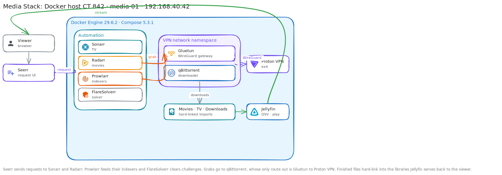

# Media Stack Walkthrough

**Created:** 2026-07-20  
**Last updated:** 2026-07-20

## What This Guide Covers

I deployed Jellyfin, Seerr, Sonarr, Radarr, Prowlarr, FlareSolverr, & qBittorrent on one Docker host. Gluetun carries qBittorrent traffic through Proton VPN. This guide follows the host build, application wiring, libraries, download handling, & checks I completed.

## Current Status and Verified Versions

The stack runs on CT 842 `media-01` at `192.168.40.42` on `red-server`. The guest has 4 vCPU, 8 GiB memory, 1 GiB swap, & a 100 GiB root disk. The recorded runtime is Docker 29.6.2 with Compose 5.3.1. Application onboarding is complete, but a full request-to-play acquisition test remains unfinished.

## What You Need

- A Debian Docker host with access to the media storage paths.
- Intel graphics passed through if you want the recorded QSV setup.
- A Proton VPN configuration for Gluetun.
- DNS and browser access to each application interface.
- Separate paths for downloads, movies, & television libraries.

## How the Pieces Fit Together



## Walkthrough

### Step 1: Build the Host and Mount Storage

I created CT 842, applied the Linux SSH baseline, installed Docker, mounted the media paths, & checked read/write access from the guest. I confirmed the container could see the Intel render device before enabling hardware transcoding.

### Step 2: Start the Compose Project

I filled the reader-editable environment values, validated the Compose model, pulled the images, & started the project.

```sh
docker compose config
docker compose pull
docker compose up -d
docker compose ps
```

I didn't continue until every service expected at this stage was running or healthy.

### Step 3: Complete Jellyfin Setup

I named the server, created the first account, & added separate Movies and TV libraries that point to the container's media paths.


### Step 4: Enable QSV Transcoding

I selected Intel Quick Sync Video in Jellyfin and saved the hardware acceleration settings only after the render device was visible inside the container.


### Step 5: Configure qBittorrent Behind Gluetun

I set qBittorrent's categories and download paths, then verified its network namespace used Gluetun. I checked the external address from the VPN path instead of assuming a running container meant the tunnel worked.


### Step 6: Connect Sonarr and Radarr

I set the Sonarr TV root, Radarr Movies root, naming rules, hard-link behavior, & qBittorrent client. The application paths match the paths mounted into the downloader, which avoids remote-path translation.


### Step 7: Add Indexers Through Prowlarr

I connected Prowlarr to Sonarr and Radarr, added the selected indexers, & used each application's test button. FlareSolverr stays available only for sources that require it.

### Step 8: Connect Seerr

I linked Seerr to Jellyfin, synchronized the libraries, & added the Sonarr and Radarr servers. The completed Discover screen populated after those connections passed.


## What I Checked After Each Step

- Docker and Compose returned the recorded versions.
- Media mounts were readable and writable from the correct containers.
- Jellyfin saved both libraries and the QSV configuration.
- qBittorrent categories and application connections passed.
- Sonarr, Radarr, Prowlarr, & Seerr connection tests succeeded.
- Seerr synchronized the Jellyfin library and populated Discover.

## Troubleshooting and Recovery

If an application can browse a path but can't import a file, compare the container-side path in the downloader and manager. If qBittorrent loses its tunnel, stop its traffic before repairing Gluetun. For a failed application update, restore the prior image tag and the matching configuration backup, then recreate only that service.

## Known Limits

I haven't recorded a complete Seerr request that moves through an indexer, qBittorrent, import, Jellyfin scan, & playback. The UI and connection checks show that the applications are wired, but they don't close that end-to-end test.

## Source Records

- [Architecture overview](../Platforms/Media%20Stack/Documentation/Architecture-Overview.md)
- [Deployment record](../Platforms/Media%20Stack/Documentation/Change%20Records/Media%20Stack%20Deployment%20-%202026-07-17.md)
- [Application onboarding record](../Platforms/Media%20Stack/Documentation/Change%20Records/Media%20Stack%20Application%20Onboarding%20-%202026-07-17.md)
- [Refresh and payload filtering record](../Platforms/Media%20Stack/Documentation/Change%20Records/Media%20Stack%20Refresh%20and%20Payload%20Filtering%20-%202026-07-17.md)
- [Runbook](../Platforms/Media%20Stack/Documentation/Runbook.md)
