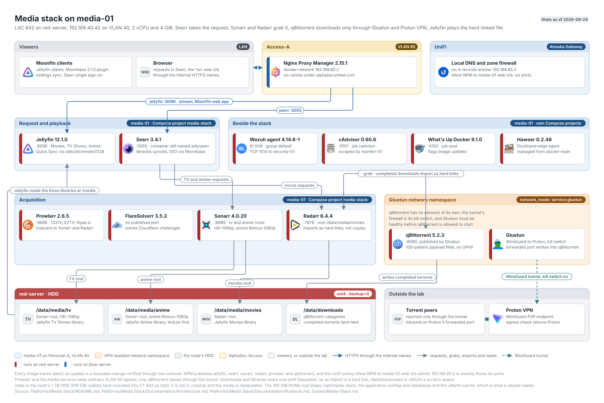

# Media Stack Walkthrough

**Created:** 2026-07-20  
**Last updated:** 2026-09-25

## What This Guide Covers

I deployed Jellyfin, Seerr, Sonarr, Radarr, Prowlarr, FlareSolverr, and qBittorrent on one Docker host on 2026-07-17. Gluetun carries qBittorrent traffic through Proton VPN. This guide follows the host build, application wiring, libraries, download handling, and the checks I ran.

## Current Status and Verified Versions

Verified on the host on 2026-09-24. The stack runs on CT 842 `media-01` at `192.168.40.42` on `red-server`: 2 vCPU, 4 GiB memory, 1 GiB swap, a 100 GiB NVMe root disk, and the 1 TB HDD at `/data`. The Compose project `/opt/media-stack/compose.yml` runs eight containers:

| Application | Version | Port |
|---|---|---|
| Jellyfin | 12.1.0 | 8096 |
| Seerr (container still named `jellyseerr`) | 3.4.1 | 5055 |
| Sonarr | 4.0.20.3014 | 8989 |
| Radarr | 6.4.4.10685 | 7878 |
| Prowlarr | 2.6.5.5623 | 9696 |
| qBittorrent | 5.2.3 | 8080, published by Gluetun |
| FlareSolverr | 3.5.2 | none published |
| Gluetun | `latest`, no version label | none of its own |

cAdvisor, What's Up Docker, and the Hawser agent run beside it in their own projects. Weebarr, the anime request front end I added on 2026-09-21, is gone from the host: no container, image, or Compose service on 2026-09-24. Its records are in the [archive](../Archive/Platforms/Weebarr/README.md).

## What You Need

- A Debian Docker host with access to the media storage paths.
- Intel graphics passed through if you want the recorded QSV setup.
- A Proton VPN configuration for Gluetun.
- DNS and browser access to each application interface.
- Separate paths for downloads, movies, and television libraries.

## How the Pieces Fit Together



## Walkthrough

### Step 1: Build the Host and Mount Storage

I created CT 842, applied the Linux SSH baseline, installed Docker Engine 29.6.2 and Compose 5.3.1, mounted the media paths, and checked read/write access from the guest. I confirmed the container could see the Intel render device before enabling hardware transcoding.

### Step 2: Start the Compose Project

I filled the reader-editable environment values, validated the Compose model, pulled the images, and started the project.

```sh
docker compose config
docker compose pull
docker compose up -d
docker compose ps
```

Before the VPN profile existed, `docker compose ps` showed the six non-VPN services running and Jellyfin healthy. After I activated the Proton profile, Gluetun reported healthy and qBittorrent started only after it. The final inspection that day showed eight containers running, Gluetun and Jellyfin healthy, and the root volume 9% used.

### Step 3: Complete Jellyfin Setup

I named the server, created the first account, and added separate Movies and TV libraries that point to the container's media paths.


### Step 4: Enable QSV Transcoding

I selected Intel Quick Sync Video in Jellyfin and saved the hardware acceleration settings only after the render device was visible inside the container.


### Step 5: Configure qBittorrent Behind Gluetun

I set qBittorrent's categories and download paths, then verified its network namespace is Gluetun's. From that namespace, the external-address check returned Proton's network as the egress organization, not my ISP's.


### Step 6: Connect Sonarr and Radarr

I set the Sonarr TV root, Radarr Movies root, naming rules, hard-link behavior, and qBittorrent client. The application paths match the paths mounted into the downloader, which avoids remote-path translation.


### Step 7: Add Indexers Through Prowlarr

I connected Prowlarr to Sonarr and Radarr, added the selected indexers, and used each application's test button. FlareSolverr stays available only for sources that require it.

### Step 8: Connect Seerr

I linked Seerr to Jellyfin, synchronized the libraries, and added the Sonarr and Radarr servers. The completed Discover screen populated after those connections passed.


### Step 9: Run One Bounded Acquisition Pass

On 2026-07-21 I requested one television episode and one movie and followed both to playback:

1. Prowlarr returned releases for both, and qBittorrent took them on the Gluetun path.
2. qBittorrent's Content list matched the payload filter during the transfer.
3. Sonarr and Radarr imported both as hard links, not copies.
4. The Jellyfin library scan picked both up.
5. Playback ran with the GPU active.

One indexer needed Cloudflare challenge handling and passed through FlareSolverr.

## What I Checked After Each Step

- Docker and Compose returned the recorded versions.
- Media mounts were readable and writable from the correct containers.
- Jellyfin saved both libraries and the QSV configuration.
- qBittorrent categories and application connections passed.
- Sonarr, Radarr, Prowlarr, and Seerr connection tests succeeded.
- Seerr synchronized the Jellyfin library and populated Discover.
- The episode and movie completed the request, download, payload, hard-link import, scan, and GPU-active playback path.

## Troubleshooting and Recovery

If an application can browse a path but can't import a file, compare the container-side path in the downloader and manager. If qBittorrent loses its tunnel, stop its traffic before repairing Gluetun. For a failed application update, pin the prior image tag and recreate only that service; its configuration lives in a bind mount under `/opt/media-stack` and survives the recreate.

## Known Limits

Everything runs on one LXC on one node with no shared storage. If `red-server` is down, so is the stack. I keep no backups of the application databases; the recovery path is a rebuild from the baseline and this guide.

## Source Records

- [Architecture overview](../Platforms/Media%20Stack/Documentation/Architecture.md)
- [Deployment record](../Platforms/Media%20Stack/Documentation/Change%20Records/Deployment%20-%202026-07-17.md)
- [Application onboarding record](../Platforms/Media%20Stack/Documentation/Change%20Records/Application%20Onboarding%20-%202026-07-17.md)
- [Refresh and payload filtering record](../Platforms/Media%20Stack/Documentation/Change%20Records/Refresh%20and%20Payload%20Filtering%20-%202026-07-17.md)
- [Runbook](../Platforms/Media%20Stack/Documentation/Runbook.md)
- [HDD data migration](../Platforms/Media%20Stack/Documentation/Change%20Records/HDD%20Data%20Migration%20-%202026-07-22.md)
- [Jellyfin 12 upgrade](../Platforms/Media%20Stack/Documentation/Change%20Records/Jellyfin%2012%20Upgrade%20-%202026-09-09.md)
