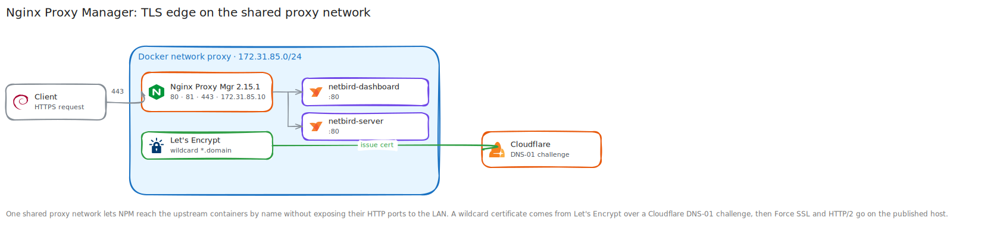

# Nginx Proxy Manager Walkthrough

**Created:** 2026-07-20  
**Last updated:** 2026-07-20

## What This Guide Covers

I deployed Nginx Proxy Manager on the NetBird host, gave it a fixed Docker address, issued a wildcard certificate through Cloudflare DNS-01, & published the NetBird dashboard and service routes over HTTPS.

## Current Status and Verified Versions

Nginx Proxy Manager 2.15.1 runs from `/opt/docker/nginx-proxy-manager` on CT 107 `docker-network`. It owns guest TCP ports 80, 81, & 443 and address `172.31.85.10` on the external `proxy` network. The recorded wildcard/apex certificate expires `2026-10-08 23:49:46 UTC`.

## What You Need

- A Docker host with TCP ports 80, 81, & 443 available.
- A domain managed in Cloudflare and a zone-scoped DNS Write token.
- A DNS name such as `<YOUR_NETBIRD_DOMAIN>` for the upstream service.
- The upstream container attached to the same external Docker network.

## How the Pieces Fit Together



## Walkthrough

### Step 1: Create the Shared Proxy Network

I created the external `proxy` network with subnet `172.31.85.0/24`. Sharing one named network lets Nginx Proxy Manager reach application containers by name without publishing their internal HTTP ports to the LAN.

### Step 2: Create and Start the Compose Project

I placed the project at `/opt/docker/nginx-proxy-manager`, mounted `data/` and `letsencrypt/`, assigned `172.31.85.10`, & published ports 80, 81, & 443.

```sh
docker compose config
docker compose up -d
docker compose ps
```

I waited for the built-in health check and HTTP 200 responses on ports 80 and 81.

### Step 3: Complete First-Run Setup

I opened the management interface on port 81, completed the administrator setup, & confirmed the dashboard reported Nginx Proxy Manager 2.15.1.


### Step 4: Add the NetBird Proxy Host

I created `<YOUR_NETBIRD_DOMAIN>` with upstream `http://netbird-dashboard:80`, WebSocket Support, & Block Common Exploits. I added the checked-in advanced routes so API, OAuth2, WebSocket, signal, management, & gRPC requests go to `netbird-server:80`.

I ran `nginx -t` inside the container and sent a Host-header request through Nginx Proxy Manager. Both checks passed before I added TLS.


### Step 5: Issue and Assign the Certificate

I created a Let's Encrypt request for `*.<YOUR_BASE_DOMAIN>` and `<YOUR_BASE_DOMAIN>`, selected Cloudflare DNS, & supplied `<YOUR_CLOUDFLARE_DNS_TOKEN>` in the provider form. After issuance, I assigned the certificate to the NetBird host and enabled Force SSL and HTTP/2.


### Step 6: Test Restart and Renewal Paths

I restarted the Nginx Proxy Manager and NetBird Compose projects, reran `nginx -t`, & loaded the authenticated HTTPS dashboard. I also ran a Let's Encrypt staging dry run for lineage `npm-1` and confirmed Nginx Proxy Manager's hourly renewal check.

## What I Checked After Each Step

- The container reported healthy and version 2.15.1.
- Ports 80 and 81 returned HTTP 200 after initialization.
- Docker inspection returned `172.31.85.10` and restart policy `unless-stopped`.
- Nginx Proxy Manager resolved both NetBird containers over `proxy`.
- The proxy host reported Online and `nginx -t` passed.
- Force SSL, HTTP/2, certificate assignment, renewal dry run, & restart recovery worked.

## Troubleshooting and Recovery

If a proxy host returns 502, test the upstream from inside the Nginx Proxy Manager container and confirm both containers share `proxy`. If Nginx rejects the saved host, run `nginx -t` and inspect the first reported file and line. Keep `data/` and `letsencrypt/` when recreating the container.

## Known Limits

HSTS was left disabled during the initial deployment. The recorded certificate expiry is a point-in-time value from 2026-07-11, so check the live certificate before relying on it.

## Source Records

- [Deployment record](../Platforms/Nginx%20Proxy%20Manager/Documentation/Deployment.md)
- [NetBird advanced configuration](../Platforms/Nginx%20Proxy%20Manager/Configuration/netbird-advanced-config.conf)
- [Runbook](../Platforms/Nginx%20Proxy%20Manager/Documentation/Runbook.md)
- [NetBird and NPM follow-ups](../Platforms/Netbird/Documentation/Change%20Records/NetBird-NPM%20Operational%20Follow-ups%20and%20Hardening%20Descope%20-%202026-07-12.md)
