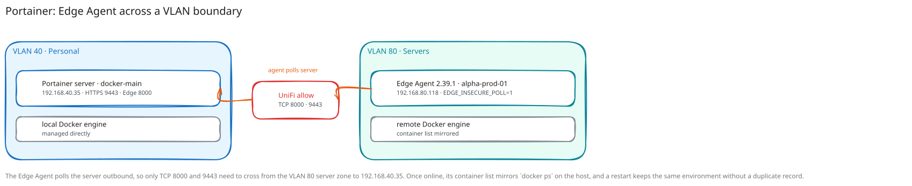

# Portainer Edge Agent Walkthrough

**Created:** 2026-07-20  
**Last updated:** 2026-08-03

## What This Guide Covers

I connected a Docker host on VLAN 80 to the Portainer server on VLAN 40 with an Edge Agent, then expanded the same pattern to three more hosts. This guide covers both Compose projects, cross-VLAN rules, environment registration, & the checks used after enrollment.

## Current Status and Verified Versions

Portainer server 2.39.5 runs on `docker-main` at `192.168.40.35` with HTTPS on 9443 and the Edge tunnel on 8000. Four remote hosts run Edge Agent 2.39.1: `alpha-prod-01`, `docker-blue`, `media-01`, & `docker-network`. They use `EDGE_INSECURE_POLL=1` across their approved internal paths.

## What You Need

- One Docker host for the Portainer server.
- One Docker host for each Edge Agent.
- TCP reachability from the agent to server ports 8000 and 9443.
- An Edge environment created in Portainer for each target host.

## How the Pieces Fit Together



## Walkthrough

### Step 1: Start the Portainer Server

I created `/opt/docker/portainer/docker-compose.yml`, published 9443 and 8000, mounted the Docker socket, & kept application data in `portainer_data`.

```sh
docker compose config
docker compose up -d
docker compose ps
```

I opened `https://192.168.40.35:9443` and confirmed the server could manage its local Docker engine.

### Step 2: Permit the Edge Polling Path

I added a UniFi allow rule from the VLAN 80 server zone to `192.168.40.35` on TCP 8000 and 9443. I tested those two ports from `alpha-prod-01` and kept other cross-VLAN traffic under the existing policy.

### Step 3: Create the Edge Environment

I selected Add Environment in Portainer, chose Edge Agent, named the environment for the target host, & copied the generated `EDGE_ID` and `EDGE_KEY` values into that host's local environment file.

### Step 4: Start the Edge Agent

I created `/opt/docker/portainer-edge-agent/docker-compose.yml` on `alpha-prod-01`, pinned `portainer/agent:2.39.1`, mounted the Docker socket, Docker volumes, host filesystem, & agent data, then started the project.

```sh
docker compose config
docker compose up -d
docker compose logs --tail 100 portainer_edge_agent
```

### Step 5: Confirm the Environment

I waited for `alpha-prod-01` to report online in Portainer, opened its container list, & compared it with `docker ps` on the host.

### Step 6: Test Restart Recovery

I restarted the Edge Agent container and confirmed the same environment returned online without creating a second Portainer record.

### Step 7: Repeat the Pattern for the Fleet

I registered `docker-blue`, `media-01`, & `docker-network` as separate environments, stored one Edge ID and key pair per host outside git, deployed the same pinned agent project, & tested both polling ports. `docker-network` required a narrow UniFi rule to `192.168.40.35` on TCP 8000 and 9443. The Portainer API returned each environment online with its remote container list.

## What I Checked After Each Step

- Portainer listened on TCP 9443 and 8000.
- The Edge host reached both approved ports across the VLAN boundary.
- Agent 2.39.1 started without an enrollment error.
- `alpha-prod-01` reported online in Portainer.
- `docker-blue`, `media-01`, & `docker-network` reported online with separate environment identities.
- The remote container list matched the host's Docker state.
- Restarting the agent preserved the environment registration.

## Troubleshooting and Recovery

If the agent stays offline, test TCP 8000 and 9443 from the agent, then compare its `EDGE_ID` and `EDGE_KEY` with the environment you created. If the ID was reused on another host, create a new Edge environment instead of copying the old local file.

## Known Limits

The agents still use `EDGE_INSECURE_POLL=1`; certificate hardening for that polling path has not been implemented.

## Source Records

- [Portainer Edge Agent setup](../Platforms/Portainer/Documentation/portainer-edge-agent.md)
- [Portainer Edge Agent fleet expansion](../Platforms/Portainer/Documentation/Change%20Records/Portainer%20Edge%20Agent%20Fleet%20Expansion%20-%202026-07-28.md)
