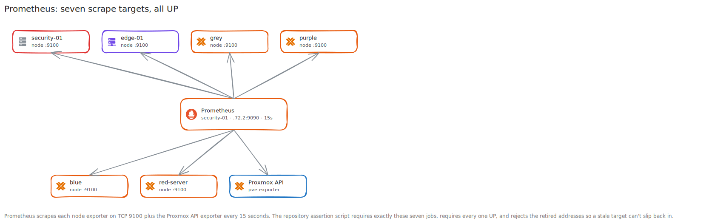

# Prometheus Walkthrough

**Created:** 2026-07-20  
**Last updated:** 2026-07-22

## What This Guide Covers

I installed the missing node exporters, removed stale scrape jobs, validated the replacement configuration, & proved that seven retained Prometheus jobs were `UP`. This guide also covers the Docker bind-mount behavior that required a restart.

## Current Status and Verified Versions

Prometheus runs on `security-01` at `192.168.72.2:9090` with a 15-second scrape interval. It scrapes `security-01`, `edge-01`, all four Galaxy nodes, & the Proxmox API exporter. Purple, blue, & red run Debian package `prometheus-node-exporter` 1.9.0-1+b4; grey runs manual node_exporter 1.9.0.

## What You Need

- A running Prometheus server and access to its configuration.
- TCP 9100 reachability from Prometheus to each node exporter.
- `promtool` for candidate validation.
- A console or SSH session on every host receiving an exporter.

## How the Pieces Fit Together



## Walkthrough

### Step 1: Record the Existing Target Set

I queried the Prometheus target API and noted each job, address, health state, & last error. The starting set contained three working jobs and three stale or down jobs.

### Step 2: Install the Missing Exporters

I installed `prometheus-node-exporter` 1.9.0-1+b4 on purple, blue, & red through APT, then enabled the service.

```sh
sudo apt update
sudo apt install prometheus-node-exporter
sudo systemctl enable --now prometheus-node-exporter
curl -fsS http://127.0.0.1:9100/metrics | grep node_uname_info
```

I repeated the HTTP check from `security-01` to prove the network path as well as the local service.

### Step 3: Reconcile the Configuration

I added one job for each Galaxy node, corrected `security-01` to `192.168.72.2`, kept the `edge-01` and Proxmox jobs, & removed the retired address plus unavailable application hosts.

### Step 4: Validate Before Applying

I checked the candidate with `promtool` before it replaced the live file.

```sh
promtool check config prometheus.yml
```

### Step 5: Apply the File and Restart When Needed

My first host-path replacement and SIGHUP left the container attached to the old single-file bind-mount inode. I restarted Prometheus so Docker rebound the current file, then checked readiness and ran `promtool` against the in-container path.

### Step 6: Assert the Exact Result

I ran the repository assertion script against the live API. It required exactly seven expected jobs, required every one to be `UP`, & rejected the stale addresses.

```sh
cd <YOUR_HOMELAB_REPO>/Platforms/Prometheus
python3 Tests/assert_targets.py
```

## What I Checked After Each Step

- All four node-exporter endpoints returned HTTP 200 with `node_uname_info`.
- The candidate and in-container configurations passed `promtool`.
- Prometheus returned ready after restart.
- Exactly seven jobs reported `UP`.
- The retired `.70.20`, `app-01`, & `supabase-01` targets were absent.

## Troubleshooting and Recovery

If a valid host-side file doesn't change the running target set after SIGHUP, compare its inode with the container mount and perform a controlled restart. If one target stays down, test its `/metrics` endpoint from the Prometheus host before changing the scrape job.

## Known Limits

The baseline removes hosts that didn't have working exporters; it doesn't claim monitoring coverage for them. Alert rules and dashboard coverage are outside this recorded change.

## Source Records

- [Prometheus overview](../Platforms/Prometheus/README.md)
- [Baseline cleanup](../Platforms/Prometheus/Documentation/Change%20Records/Security%20Monitoring%20Baseline%20Cleanup%20-%202026-07-13.md)
- [Versioned configuration](../Platforms/Prometheus/Configuration/prometheus.yml)
- [Runbook](../Platforms/Prometheus/Documentation/Runbook.md)
- [Troubleshooting index](../Platforms/Prometheus/Documentation/Troubleshooting/README.md)
