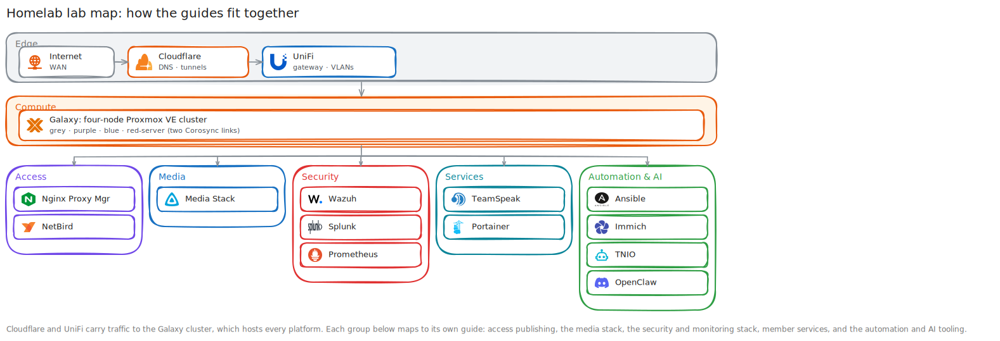

# Homelab Guides

**Created:** 2026-07-20  
**Last updated:** 2026-07-20

This directory is the shortest route through my homelab. Each guide turns the current build records, runbooks, screenshots, & verified command results into one sequence a reader can follow without opening every infrastructure folder first.

The original records still own the facts. A guide explains the path; its Source Records section points back to the dated change, current configuration, rollback notes, & troubleshooting history.

## Lab Map

## Infrastructure and Shared Procedures

| Guide | What it covers |
|---|---|
| [Galaxy Proxmox Cluster](Galaxy-Proxmox-Cluster.md) | Four-node cluster setup, node expansion, Corosync link1, firewall objects, Docker LXC foundation, & Debian development VM |
| [UniFi Network](UniFi-Network.md) | VLANs, zones, Security-A migration, DNS, egress policy order, & verification |
| [Linux Host Baseline](Linux-Host-Baseline.md) | Package updates, administrative account, three SSH keys, key-only SSH, locked root, locale, & checks |
| [SSH Key Lifecycle](SSH-Key-Lifecycle.md) | Key inventory, fleet cleanup, onboarding, staged rotation, verification, & retirement |
| [Security Incident Response](Security-Incident-Response.md) | Scope, containment, credential rotation, service checks, residual risk, & closure |

## Platform Guides

| Guide | What it covers |
|---|---|
| [Ansible SSH Identity Automation](Ansible-SSH-Identity-Automation.md) | Controller setup, identity files, audit, onboarding, rotation, Semaphore, & recovery |
| [Immich Storage Migration](Immich-Storage-Migration.md) | Database backup, replacement pool, file copy, verification, & old-disk retirement |
| [Media Stack](Media-Stack.md) | LXC, Docker services, VPN-isolated qBittorrent, Jellyfin, Arr applications, Seerr, & pending acquisition test |
| [NetBird](NetBird.md) | Control plane, NPM publication, peer enrollment, routed subnet, access policy, & tunnel verification |
| [Nginx Proxy Manager](Nginx-Proxy-Manager.md) | Compose deployment, first-run setup, NetBird routes, DNS-01 certificate, health checks, & renewal |
| [OpenClaw](OpenClaw.md) | Discord scope, mention behavior, session reset, systemd service, & resolver workflow |
| [Portainer](Portainer.md) | Portainer server, Edge Agent Compose project, UniFi ports, & environment registration |
| [Prometheus](Prometheus.md) | Node exporters, seven scrape jobs, config validation, reload behavior, & target checks |
| [Splunk](Splunk.md) | Rocky VM, Splunk Enterprise, HEC, SC4S, UniFi CEF routing, field checks, & Enterprise Security |
| [TeamSpeak](TeamSpeak.md) | Three servers, Playit tunnels, Cloudflare SRV records, TS3 Manager, boot recovery, & outage checks |
| [Termix](Termix.md) | Upgrade, reusable Ed25519 identity, nine SSH hosts, folders, connection checks, & rollback |
| [TNIO AI Bot](TNIO-AI-Bot.md) | Lore RAG source, remote runtime, retrieval fixes, corpus audits, tests, & service checks |
| [Wazuh](Wazuh.md) | Endpoint removal, fresh enrollment, manager checks, dashboard state, & recovery |

## Status Language

`Verified` means the linked record contains the observed command result, UI state, or screenshot. `Partial` names the exact unfinished check. I don't turn a plan into a completed result because the command appears plausible.

Cloudflare and Windows Servers don't have standalone guides yet. Their current public records contain inventories or supporting steps, not a complete deployment sequence.
