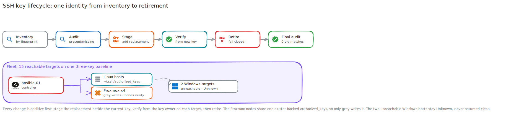

# SSH Key Lifecycle Walkthrough

**Created:** 2026-07-20  
**Last updated:** 2026-07-20

## What This Guide Covers

This guide follows one SSH identity from inventory through onboarding, rotation, verification, & retirement. It also covers the fleet cleanup that normalized 15 reachable targets to the same three-key baseline.

## Current Status and Verified Versions

The fleet baseline contains three approved ED25519 public keys. The 2026-07-14 cleanup removed two retired keys, found zero remaining matches across 15 readable targets, & left two unreachable Windows targets marked Unknown.

## What You Need

- The public key, fingerprint, label, allowed host list, account, & authorized-key path for one identity.
- A second working administrative path before removing a key.
- The Ansible project at `/home/ansible/ssh-key-automation`, or equivalent manual SSH access.

## How the Pieces Fit Together



## Walkthrough

### Step 1: Inventory the Identity

Record the key by fingerprint, not comment. Comments can change without changing the key blob.

```sh
ssh-keygen -lf <YOUR_PUBLIC_KEY_FILE>
```

### Step 2: Audit the Targets

From the Ansible project, run the identity audit with its target allowlist. The audit must report the exact present, missing, duplicate, & unexpected states before any mutation.

```sh
cd /home/ansible/ssh-key-automation
ansible-playbook playbooks/ssh-key-audit.yml \
  -e ssh_identity=<YOUR_IDENTITY_NAME>
```

### Step 3: Onboard or Stage a Replacement

Use the additive playbook for a new identity. For rotation, stage the replacement beside the current key; don't remove the old key yet.

```sh
ansible-playbook playbooks/ssh-identity-onboard.yml \
  -e ssh_identity=<YOUR_IDENTITY_NAME> \
  -e ssh_target_group=<YOUR_TARGET_GROUP>
ansible-playbook playbooks/ssh-key-stage.yml \
  -e ssh_identity=<YOUR_IDENTITY_NAME>
```

### Step 4: Verify from the New Key

Connect through every allowed target with the replacement identity. Check the exact fingerprint on each file & confirm the old management path still works during this phase.

### Step 5: Retire the Old Key

Run the verification gate, then the retirement playbook. The retirement path should fail closed when any target lacks proof of the replacement.

```sh
ansible-playbook playbooks/ssh-key-verify.yml \
  -e ssh_identity=<YOUR_IDENTITY_NAME>
ansible-playbook playbooks/ssh-key-retire.yml \
  -e ssh_identity=<YOUR_IDENTITY_NAME> \
  -e 'ssh_retire_confirmation=RETIRE <YOUR_IDENTITY_NAME>'
```

### Step 6: Run the Final Audit

The final result must show one replacement key, zero old-key matches, zero duplicates, & no target outside the allowlist.

## What I Checked After Each Step

- All 15 reachable hosts retained SSH access after the 2026-07-14 cleanup.
- `ssh-keygen` parsed every changed Linux file.
- `/etc/pve/priv/authorized_keys` was changed once, then checked from all four Proxmox nodes.
- The live Ansible playbook passed `ansible-playbook --syntax-check`.

## Troubleshooting and Recovery

If a staged key can't authenticate, leave the old key installed. Restore a retired key through the second administrative path, rerun the audit, & identify whether the failure is the username, path, file mode, allowlist, or key blob.

## Known Limits

Connected-account coverage doesn't prove the absence of keys in an unreadable account or nonstandard `AuthorizedKeysFile`. The two unreachable Windows targets remain Unknown until TCP/22 & their configured accounts can be checked.

## Source Records

- [SSH Authorized Key Cleanup](../Operations/Maintenance/SSH%20Authorized%20Key%20Cleanup%20-%202026-07-14.md)
- [Ansible runbook](../Platforms/Ansible/Documentation/Runbook.md)
- [SSH identity automation change](../Platforms/Ansible/Documentation/Change%20Records/SSH%20Identity%20Automation%20-%202026-07-14.md)
