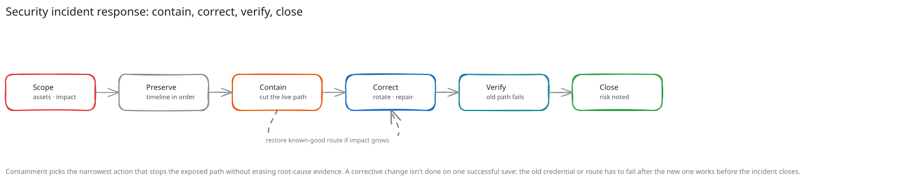

# Security Incident Response Walkthrough

**Created:** 2026-07-20  
**Last updated:** 2026-08-03

## What This Guide Covers

I use this sequence for a service-impacting or security incident: define the affected systems, preserve a timeline, remove the exposed path, rotate affected access, verify the new state, record residual risk, & close only after the old path fails.

## Current Status and Verified Versions

The repository contains one April 2026 application-stack access review & two TeamSpeak incident records from 2026-04-24. The TeamSpeak UDP relay outage was restored through tunnel & DNS checks; the application review rotated primary access paths & disabled legacy values.

## What You Need

- The first observed time, affected service, user-visible symptom, & reporter.
- Current provider dashboards, service logs, DNS, firewall, & authentication records.
- A list of every system that can reach or trust the affected component.
- A rollback point for each corrective change.

## How the Pieces Fit Together

## Walkthrough

### Step 1: Define Scope and Impact

Write the affected assets, start time, symptom, & known user impact before changing state. Separate confirmed facts from working hypotheses.

### Step 2: Preserve the Timeline

Record provider events, service logs, DNS changes, firewall changes, authentication events, & operator actions in timestamp order. Keep the original time zone beside the timeline.

### Step 3: Contain the Active Path

Disable the exposed integration, route, account, tunnel, or key that creates current risk. Pick the narrowest action that stops the path without erasing the data needed for the root-cause check.

### Step 4: Correct the Configuration

Rotate affected access, remove legacy entries, repair the tunnel or DNS target, & update each dependent service. One successful save isn't enough; the old value or route must fail after the new one works.

### Step 5: Verify Service and Security State

Repeat the user path, backend path, authentication check, DNS lookup, & provider status that define recovery. For the TeamSpeak relay outage, this meant the SRV chain, Playit tunnel, UDP voice path, local container, & TS3 Manager view.

### Step 6: Record Residual Risk and Close

List follow-ups with owners & conditions. Close the incident only when the service is stable, the exposed path is disabled, the verification results are recorded, & any residual risk has a bounded next action.

## What the Report Contains

Step 6 produces the report. I keep it under `Security/Incidents/`, separate from the affected service's own records, so an incident stays findable whether I go looking by service or by date. Each report carries:

- Metadata: the date, the affected service, and the closure status.
- A summary a reader can take in without the detail below it.
- Impact, in terms of what stopped working and for whom.
- Affected assets: the hosts, guests, networks, and accounts in scope.
- Symptoms, including the exact error text where I captured it.
- A timeline, where I have the timestamps to build one.
- Findings, then the root cause, or the current hypothesis when I never proved one.
- Corrective action, and the validation that shows it worked.
- Residual risk and follow-ups, with the closure status saying plainly whether this is finished.

Routine troubleshooting isn't an incident. Those records live with the platform that owns them. When a problem turns into an incident, I write the report and cross-link both records so neither is a dead end.

## What I Checked After Each Step

- Corrective actions had an observed result, not just a successful command submission.
- Old access failed where rotation was part of containment.
- User-facing traffic & backend health both passed.
- Incident reports link the platform records that own the final configuration.

## Troubleshooting and Recovery

If a containment change increases impact, restore the last known-good service route while keeping the exposed identity disabled. Split availability recovery from the security correction when one rollback can't safely restore both.

## Known Limits

This guide doesn't replace provider-specific incident procedures. A disclosure involving billing, legal notice, or third-party user data needs the applicable external response path in addition to the technical record.

## Source Records

- [Application-stack incident response](../Security/Incidents/Vercel/security-incident-response-2026-04-19.md)
- [TeamSpeak service incident](../Security/Incidents/Teamspeak/TeamSpeak-Incident-Report-2026-04-24.md)
- [TeamSpeak UDP relay outage](../Security/Incidents/Teamspeak/TeamSpeak-Incident-Report-2026-04-24-UDP-Relay-Outage.md)
