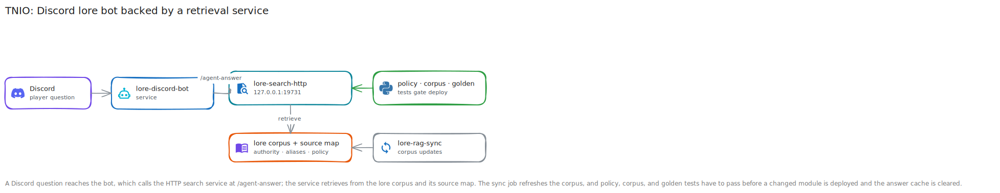

# TNIO AI Bot Walkthrough

**Created:** 2026-07-20  
**Last updated:** 2026-07-20

## What This Guide Covers

I operate TNIO as a Discord bot backed by a lore retrieval service. This walkthrough shows how I compare the repository source with the deployed tree, update the corpus and source map, run policy and corpus tests, restart the services, & test the live answer endpoint.

## Current Status and Verified Versions

The operated project path is `/home/<YOUR_DEPLOYMENT_USER>/lore-rag`. The repository contains primary, remote, experimental, & legacy source snapshots plus policy, corpus, and golden-evaluation tests. The records describe repeated live fixes and accuracy audits, but they don't contain a clean deployment from an empty host or one product version number.

## What You Need

- A Linux host with the deployed TNIO project.
- Python dependencies used by the retrieval service and tests.
- The current lore corpus and generated state files.
- User services for the HTTP search service, Discord bot, & corpus sync job.
- A small set of known-answer questions for live checks.

## How the Pieces Fit Together



## Walkthrough

### Step 1: Identify the Source You Intend to Deploy

I treat `Source/lore-rag/` as the primary snapshot and `Source/lore-rag-remote/` as the remote variant. Before copying anything, I compare the selected files with `/home/<YOUR_DEPLOYMENT_USER>/lore-rag` and record which service consumes each one.

### Step 2: Check Service and Sync State

I inspect `lore-search-http.service`, `lore-discord-bot.service`, & `lore-rag-sync.service` before a change. I also read `state/sync_status.json`; a failure count above zero or an old success timestamp means the corpus may be stale.

### Step 3: Update the Corpus and Source Map

I run the corpus synchronization, inspect its change report, rebuild the source map when documents changed, & confirm that authority labels, aliases, policy cards, and overlap rules match the new corpus.

### Step 4: Compile the Changed Python Files

I run Python's compiler over every changed module and test before restarting a service.

```sh
python3 -m py_compile \
  lore_agent.py lore_mcp_server.py lore_source_map.py \
  test_accuracy_policy.py test_corpus_accuracy.py
```

### Step 5: Run Policy and Corpus Tests

I run the direct-answer policy suite, corpus accuracy suite, & golden evaluation when its files are present.

```sh
python3 test_accuracy_policy.py
python3 test_corpus_accuracy.py
python3 test_golden_eval_suite.py
```

I stop if a known-answer question loses its expected source, entity, or policy route.

### Step 6: Deploy the Matched Files

I copy only the files covered by the change, keep a dated server-side recovery copy, & compare hashes after transfer. I don't replace the entire deployed tree for a one-module fix.

### Step 7: Restart the Affected Services

I restart `lore-search-http.service` for retrieval changes and `lore-discord-bot.service` for Discord changes. A corpus sync restarts the search service only when the corpus version changes.

### Step 8: Run Live Smoke and Golden Checks

I send known questions to `POST http://127.0.0.1:19731/agent-answer`, inspect the returned answer and sources, then test the same behavior through Discord. I clear or version the answer cache when a change would otherwise reuse an old result.

## What I Checked After Each Step

- Changed Python modules compiled.
- Policy, corpus, & golden tests passed for the recorded upgrades.
- Sync status reported success and the expected corpus change.
- The HTTP service and Discord bot returned after restart.
- Known-answer smoke tests cited the intended source instead of a nearby but wrong record.
- Cache invalidation prevented pre-change answers from masking the result.

## Troubleshooting and Recovery

If tests pass but the live answer is old, check the deployed file hash, service start time, & cache version. If sync stops, inspect `lore-rag-sync.service` and `state/sync_status.json` before rebuilding the index. Restore only the dated copies for the current change, then restart the same services you touched.

## Known Limits

This is an operation and validation guide, not a clean-install recipe. The repository contains several source generations, and the source records must decide which one matches the live host before deployment.

## Source Records

- [TNIO platform overview](../Platforms/TNIO%20AI%20Bot/README.md)
- [Product overview](../Platforms/TNIO%20AI%20Bot/Documentation/Product/TNIO-Librarian-Product-Overview.md)
- [Fixes report](../Platforms/TNIO%20AI%20Bot/Documentation/Change%20Records/tnio-bot-fixes-report-2026-05-11.md)
- [Full corpus audit](../Platforms/TNIO%20AI%20Bot/Documentation/Change%20Records/tnio-bot-full-corpus-audit-report-2026-05-12.md)
- [Accuracy policy report](../Platforms/TNIO%20AI%20Bot/Documentation/Change%20Records/tnio-bot-accuracy-policy-report-2026-05-12.md)
- [Full accuracy upgrade](../Platforms/TNIO%20AI%20Bot/Documentation/Change%20Records/tnio-bot-full-accuracy-upgrade-report-2026-05-13.md)
- [Test notes](../Platforms/TNIO%20AI%20Bot/Tests/README.md)
