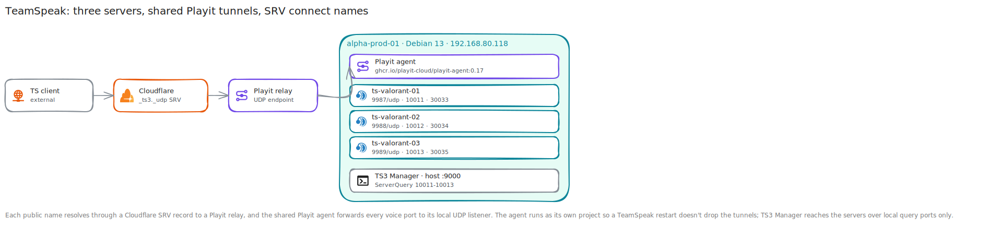

# TeamSpeak Hosting Walkthrough

**Created:** 2026-07-20  
**Last updated:** 2026-07-20

## What This Guide Covers

I run three TeamSpeak servers on one Debian host, publish their UDP voice ports through a shared Playit agent, use Cloudflare SRV records for the connect names, & manage them from TS3 Manager. This guide covers the port plan, separate Compose projects, tunnel mapping, DNS, & boot recovery.

## Current Status and Verified Versions

`alpha-prod-01` runs Debian 13 at `192.168.80.118` on VLAN 80. The three TeamSpeak containers use UDP 9987, 9988, & 9989; ServerQuery uses TCP 10011, 10012, & 10013; file transfer uses TCP 30033, 30034, & 30035. TS3 Manager listens on host port 9000. The shared Playit image is `ghcr.io/playit-cloud/playit-agent:0.17`.

## What You Need

- A Debian Docker host with three unused voice, query, & file-transfer port sets.
- One Playit tunnel per public TeamSpeak voice endpoint.
- A DNS zone where you can create CNAME and SRV records.
- One directory and named data volume per TeamSpeak server.
- Local browser access to TS3 Manager if you want the recorded admin path.

## How the Pieces Fit Together

## Walkthrough

### Step 1: Reserve a Port Set for Each Server

I assigned a unique voice, ServerQuery, & file-transfer port before creating containers. Because the TeamSpeak containers use host networking, duplicate ports would fail at startup.

| Server | Voice | ServerQuery | File transfer |
|---|---:|---:|---:|
| `ts-valorant-01` | 9987/udp | 10011/tcp | 30033/tcp |
| `ts-valorant-02` | 9988/udp | 10012/tcp | 30034/tcp |
| `ts-valorant-03` | 9989/udp | 10013/tcp | 30035/tcp |

### Step 2: Create Separate Compose Projects

I created one Compose project and named volume per server. I set each virtual server's voice, query, & file-transfer ports to the reserved values, then started one project at a time and checked its logs for the listening ports.

### Step 3: Start the Shared Playit Agent

I deployed `playit-agent` as a separate host-network project so a TeamSpeak container restart doesn't remove the tunnels. I created one UDP tunnel for each local voice port and recorded the assigned relay host and port.

### Step 4: Add the Cloudflare Records

For each public name, I created a DNS-only CNAME for the relay host and an `_ts3._udp` SRV record that points directly to the Playit hostname and assigned port. I didn't point the SRV target at the CNAME because some TeamSpeak clients reject an alias there.

### Step 5: Connect and Claim Each Server

I connected through each friendly DNS name, confirmed it opened the intended virtual server, claimed the generated administrator privilege where required, & set the server name and access policy.

### Step 6: Add TS3 Manager

I started `ts3-manager` on port 9000. Its ServerQuery entries use `192.168.80.118` and local query ports 10011, 10012, & 10013, not the public Playit names.

### Step 7: Add Boot Recovery

I kept the Playit lifecycle independent and added the recorded boot-recovery script to wait for Docker and DNS before restarting the TeamSpeak projects and Playit agent. This fixed the outage path where the containers started before the tunnel could resolve.

### Step 8: Test Every Public Name

I restarted the projects, checked the local UDP listeners, watched the Playit tunnels reconnect, & joined all three DNS names from an external TeamSpeak client.

## What I Checked After Each Step

- Each container bound only its assigned port set.
- Each Playit tunnel forwarded to the matching loopback UDP port.
- Every SRV lookup returned the intended relay hostname and port.
- Each public name opened the correct TeamSpeak server.
- TS3 Manager reached all three local ServerQuery ports.
- Boot recovery returned the voice servers and tunnels after restart.

## Troubleshooting and Recovery

If a public name fails, test the TeamSpeak UDP listener, Playit tunnel state, SRV answer, & external client in that order. If one server works and another doesn't, compare their local port assignments before changing DNS. Restore a named volume only to its matching Compose project.

## Known Limits

The document tracks three public voice servers and a fourth registered Playit tunnel, but only the three TeamSpeak mappings are described here. TeamSpeak 3's original administrator claim wasn't confirmed in the source record.

## Source Records

- [TeamSpeak deployment record](../Platforms/Teamspeak%20Hosting/Documentation/Teamspeak-deployment.md)
