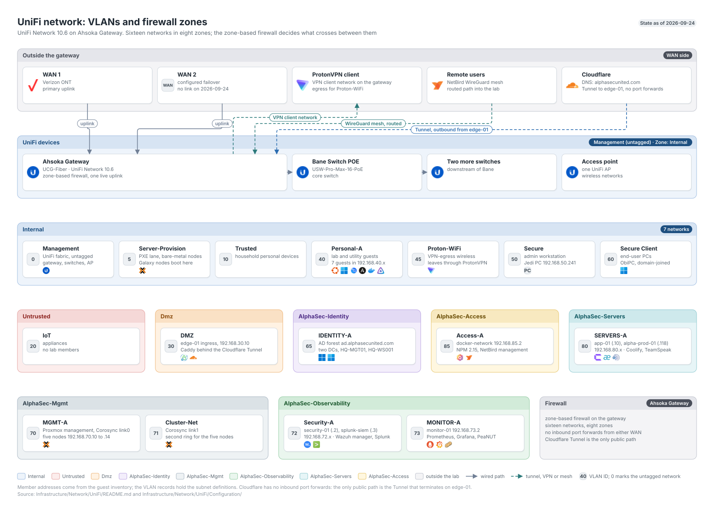

# UniFi Network Walkthrough

**Created:** 2026-07-20  
**Last updated:** 2026-09-09

## What This Guide Covers

This guide follows the network work that supports Galaxy & the hosted platforms: VLANs, firewall zones, the Security-A migration, the Access-A egress rules, local DNS, & the switch-port checks needed for Corosync VLAN 71.

## Current Status and Verified Versions

The controller has 22 networks, including 15 routed corporate LANs, and 11 zones. The active records cover VLAN 30 for the DMZ, VLAN 40 for personal workloads, VLAN 71 for Cluster-Net, VLAN 72 for Security-A, VLAN 73 for MONITOR-A, VLAN 80 for servers, and VLAN 85 for Access-A. Cluster-Net shares the management zone. Security-A and MONITOR-A share the observability zone. UniFi also holds 29 enabled local DNS entries as of 2026-09-06: 24 NPM names at `192.168.85.2` plus five Proxmox node names on MGMT-A. The same readback returned 68 user-defined firewall policies and 16 reusable Network Lists.

## What You Need

- Administrator access to the UniFi controller.
- A current export or screenshot of the affected VLAN, zone, port, & firewall tables.
- Console access to any Proxmox node whose management or Corosync path will change.
- The exact source, destination, protocol, & port list for each policy.

## How the Pieces Fit Together

## Walkthrough

### Step 1: Record VLANs and Zones

I start with the current [VLAN inventory](../Infrastructure/Network/UniFi/Configuration/network-vlan.md) & [zone inventory](../Infrastructure/Network/UniFi/Configuration/zone.md). A VLAN ID, subnet, gateway, DHCP state, & zone assignment must agree before I write a policy against it.

### Step 2: Verify Switch Trunks

For Cluster-Net, I checked all four Proxmox switch ports before adding `vmbr0.71`. VLAN 71 was already tagged to grey, purple, & blue; red needed the VLAN admitted before its host interface could communicate.

### Step 3: Migrate the Security Services

I moved Wazuh, Prometheus, Grafana, Splunk, HEC, & SC4S from the earlier management addresses into Security-A. I updated the guest addresses, DNS or client targets, & firewall destinations in the same bounded change, then checked every listener from an allowed source.

### Step 4: Add Ordered Access-A Egress

I created three Access-to-External rules in this order:

1. Allow TCP 80 and 443 from the approved Access-A service addresses.
2. Allow UDP 123 from those same addresses.
3. Block the remaining Access-A traffic to External.

The current rules use `PG-Egress-Web` and `PG-NTP`. The reverse proxy itself is represented by `AG-Reverse-Proxy` in its cross-zone policies.

### Step 5: Add Local DNS

I added `netbird.alphasecunited.com` as an A record for `192.168.85.2` with TTL 300. The browser path, NPM certificate, & NetBird HTTPS check all depend on clients resolving that internal address. The current enabled set contains NetBird, 21 application names, and five Proxmox node names. No disabled record remains.

### Step 6: Order Identity Egress and Point Clients at the Domain Controllers

The Active Directory build on VLAN 65 needed two gateway changes, and both are ordering or placement problems rather than new capability.

The identity zone had three policies to External: an allow for TCP 80 and 443, an allow for UDP 123, and a catch-all block. The NTP allow sat below the block, so it never ran, and the controller holding the PDC emulator role fell back to its own CMOS clock. Every machine in the domain inherits that drift. Moving the NTP allow above the block is the whole fix. The saved order after reload is `Allow Identity Web Egress` at index 10000, `Allow Identity NTP Egress` at 10001, then `Block Identity Other External Egress` at 10002.

<!--  -->

Then DHCP DNS on the two client networks moved from automatic to the two domain controllers, `192.168.65.10` first and `192.168.65.11` second. Domain members have to resolve through the domain controllers; pointing them at the gateway breaks service location lookups.

<!--  -->

<!--  -->

Check the firewall before assuming the DNS change is enough. Both client networks sit in the Internal zone and the controllers sit in the identity zone, so the traffic crosses a zone boundary where the default is a block. In my case an existing policy already covered it, matching the two client networks as source and an address group of the two controllers on the domain-member port set. Verify that path exists rather than adding a second rule for it, and be careful reading a filtered policy list: the controller returns a capped page, so a rule can be absent from the list and present on the gateway.

Afterwards `w32tm /query /source` on the PDC named an external server instead of `Local CMOS Clock`, and the two downstream hosts followed the domain hierarchy at stratum 5 and 6.

## What I Checked After Each Step

- Web traffic returned HTTP `200` or the expected registry `401`.
- `ntpdig` exited `0` through UDP 123.
- Direct external DNS to `1.1.1.1:53` timed out under the final block.
- Security-A services returned their expected HTTP codes & listeners.
- The final UniFi dashboard remained healthy after Cluster-Net was added.

## Troubleshooting and Recovery

Rule order matters. If the catch-all block sits above the two allows, HTTPS & NTP fail together. If only the hostname fails, check the local DNS record before changing firewall state. Roll back one policy or DNS record at a time & repeat the same test that failed.

## Known Limits

This guide covers the completed Security-A, Cluster-Net, Access-A, and consolidation work. The retired Kasm networks and zones are not part of the current topology.

## Source Records

- [UniFi configuration index](../Infrastructure/Network/UniFi/README.md)
- [Security-A migration](../Infrastructure/Network/UniFi/Documentation/Change%20Records/Security-A%20Migration%20-%202026-07-12.md)
- [Zone and object consolidation](../Infrastructure/Network/UniFi/Documentation/Change%20Records/Zone%20and%20Object%20Consolidation%20-%202026-07-27.md)
- [Access-A deployment](../Infrastructure/Compute/Galaxy/Documentation/Change%20Records/Galaxy%20Docker-Network%20LXC%20Deployment%20-%202026-07-10.md)
- [Local DNS inventory](../Infrastructure/Network/UniFi/Configuration/local-dns.md)
- [Identity NTP and client DNS](../Infrastructure/Network/UniFi/Documentation/Change%20Records/Identity%20NTP%20and%20Client%20DNS%20-%202026-09-09.md)
- [Active Directory guide](Active-Directory.md) for the forest these two changes serve
