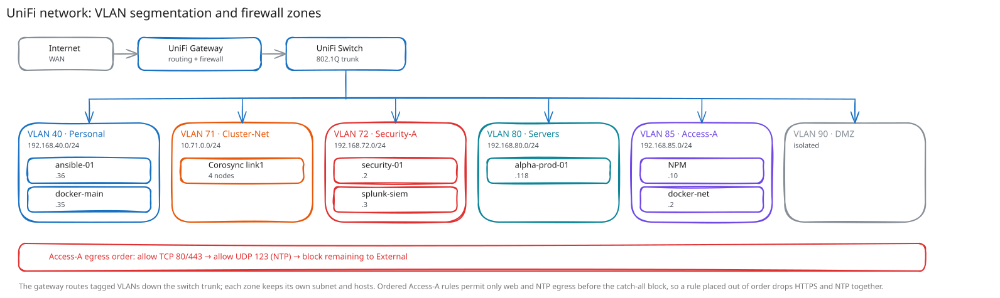

# UniFi Network Walkthrough

**Created:** 2026-07-20  
**Last updated:** 2026-07-27

## What This Guide Covers

This guide follows the network work that supports Galaxy & the hosted platforms: VLANs, firewall zones, the Security-A migration, the Access-A egress rules, local DNS, & the switch-port checks needed for Corosync VLAN 71.

## Current Status and Verified Versions

The active records cover VLAN 40 for personal workloads, VLAN 71 for Cluster-Net, VLAN 72 for Security-A, VLAN 73 for MONITOR-A, VLAN 80 for servers, VLAN 85 for Access-A, and VLAN 90 for the DMZ. Cluster-Net shares the management zone. Security-A and MONITOR-A share the observability zone.

## What You Need

- Administrator access to the UniFi controller.
- A current export or screenshot of the affected VLAN, zone, port, & firewall tables.
- Console access to any Proxmox node whose management or Corosync path will change.
- The exact source, destination, protocol, & port list for each policy.

## How the Pieces Fit Together

## Walkthrough

### Step 1: Record VLANs and Zones

I start with the current [VLAN inventory](../Infrastructure/Network/UniFi/Configuration/network-vlan.md) & [zone inventory](../Infrastructure/Network/UniFi/Configuration/zone.md). A VLAN ID, subnet, gateway, DHCP state, & zone assignment must agree before I write a policy against it.

### Step 2: Verify Switch Trunks

For Cluster-Net, I checked all four Proxmox switch ports before adding `vmbr0.71`. VLAN 71 was already tagged to grey, purple, & blue; red needed the VLAN admitted before its host interface could communicate.

### Step 3: Migrate the Security Services

I moved Wazuh, Prometheus, Grafana, Splunk, HEC, & SC4S from the earlier management addresses into Security-A. I updated the guest addresses, DNS or client targets, & firewall destinations in the same bounded change, then checked every listener from an allowed source.

### Step 4: Add Ordered Access-A Egress

I created three Access-to-External rules in this order:

1. Allow TCP 80 and 443 from the approved Access-A service addresses.
2. Allow UDP 123 from those same addresses.
3. Block the remaining Access-A traffic to External.

The current rules use `PG-Egress-Web` and `PG-NTP`. The reverse proxy itself is represented by `OBJ-Reverse-Proxy` in its cross-zone policies.

### Step 5: Add Local DNS

I added `<YOUR_NETBIRD_DOMAIN>` as an A record for `192.168.85.2` with TTL 300. The browser path, NPM certificate, & NetBird HTTPS check all depend on clients resolving that internal address.

## What I Checked After Each Step

- Web traffic returned HTTP `200` or the expected registry `401`.
- `ntpdig` exited `0` through UDP 123.
- Direct external DNS to `<YOUR_EXTERNAL_DNS_IP>:53` timed out under the final block.
- Security-A services returned their expected HTTP codes & listeners.
- The final UniFi dashboard remained healthy after Cluster-Net was added.

## Troubleshooting and Recovery

Rule order matters. If the catch-all block sits above the two allows, HTTPS & NTP fail together. If only the hostname fails, check the local DNS record before changing firewall state. Roll back one policy or DNS record at a time & repeat the same test that failed.

## Known Limits

This guide covers the completed Security-A, Cluster-Net, Access-A, and consolidation work. The three Kasm zones remain separate by design.

## Source Records

- [UniFi configuration index](../Infrastructure/Network/UniFi/README.md)
- [Security-A migration](../Infrastructure/Network/UniFi/Documentation/Change%20Records/Security-A%20Migration%20-%202026-07-12.md)
- [Zone and object consolidation](../Infrastructure/Network/UniFi/Documentation/Change%20Records/Zone%20and%20Object%20Consolidation%20-%202026-07-27.md)
- [Access-A deployment](../Infrastructure/Compute/Galaxy/Documentation/Change%20Records/Galaxy%20Docker-Network%20LXC%20Deployment%20-%202026-07-10.md)
