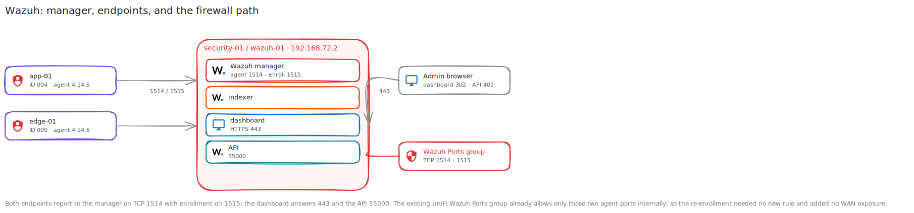

# Wazuh Walkthrough

**Created:** 2026-07-20  
**Last updated:** 2026-07-20

## What This Guide Covers

I run the Wazuh manager, indexer, dashboard, & API on the security host. This guide covers manager health, clean endpoint enrollment, network checks, dashboard confirmation, & endpoint retirement.

## Current Status and Verified Versions

The Wazuh stack runs on `security-01` / `wazuh-01` at `192.168.72.2`. The dashboard uses HTTPS 443, the API uses 55000, agent events use TCP 1514, & enrollment uses TCP 1515. `app-01` is ID 004 and `edge-01` is ID 005; both run agent 4.14.5-1 and report Active.

## What You Need

- A working Wazuh manager, indexer, dashboard, & API.
- An endpoint supported by the manager version.
- TCP 1514 and 1515 from the endpoint to the manager.
- Administrative access to the endpoint and Wazuh dashboard.

## How the Pieces Fit Together



## Walkthrough

### Step 1: Check the Manager

I check all three units, the four expected listeners, dashboard response, API response, & current agent list before enrolling an endpoint.

```sh
systemctl is-active wazuh-manager wazuh-indexer wazuh-dashboard
ss -lnt | grep -E ':(443|1514|1515|55000)[[:space:]]'
curl -k -sS -o /dev/null -w '%{http_code}\n' https://127.0.0.1/
curl -k -sS -o /dev/null -w '%{http_code}\n' https://127.0.0.1:55000/
sudo /var/ossec/bin/agent_control -l
```

The expected unauthenticated responses are 302 from the dashboard and 401 from the API.

### Step 2: Remove a Stale Endpoint State

For a clean retry, I stop the endpoint agent, remove only its obsolete manager ID, uninstall the old package and `/var/ossec` state, & confirm the old ID no longer appears. I leave unrelated manager identities alone.

### Step 3: Install from the Dashboard Workflow

In Wazuh Dashboard, I open Agents management, choose Deploy new agent, select the endpoint platform, set the manager address to `192.168.72.2`, & run the generated endpoint installation command. I used this path for `app-01` and `edge-01`.

### Step 4: Start and Check the Agent

I enable the endpoint service, confirm it is active, & test TCP 1514 and 1515 to the manager. I then check that the ongoing session uses TCP 1514.

### Step 5: Confirm the Manager Identity

I refresh the Endpoints page and match the agent ID, hostname, address, package, cluster node, & Active state with the endpoint I just installed.


### Step 6: Verify the Existing Policy Path

I check that the internal UniFi rules still point to `192.168.72.2` and that the `Wazuh Ports` group contains only TCP 1514 and 1515. The recorded enrollment needed no new rule and added no WAN exposure.

### Step 7: Retire an Endpoint

I stop its agent, remove the exact current manager ID, purge endpoint state only when I intend a clean reinstall, & check the manager list again. I don't restore the retired IDs 002 or 003.

## What I Checked After Each Step

- Manager, indexer, & dashboard units were active.
- Ports 443, 55000, 1514, & 1515 were listening.
- Dashboard 302 and unauthenticated API 401 matched the expected healthy responses.
- Both endpoint services were enabled and active.
- `app-01` ID 004 and `edge-01` ID 005 reported Active on `node01`.
- The existing internal firewall path allowed only the two Wazuh agent ports.

## Troubleshooting and Recovery

If an endpoint stays pending, compare its hostname and manager address, test TCP 1514 and 1515, inspect the endpoint service, & check the manager list for an older identity with the same name. For a clean retry, remove only the failed current identity and repeat the dashboard deployment workflow.

## Known Limits

`app-01` and `edge-01` are the only intended endpoints in the current record. The dashboard uses its existing self-signed certificate.

## Source Records

- [Wazuh overview](../Platforms/Wazuh/README.md)
- [Runbook](../Platforms/Wazuh/Documentation/Runbook.md)
- [Endpoint removal](../Platforms/Wazuh/Documentation/Change%20Records/Wazuh%20Endpoint%20Agent%20Removal%20-%202026-07-13.md)
- [Endpoint re-enrollment](../Platforms/Wazuh/Documentation/Change%20Records/Wazuh%20Endpoint%20Re-enrollment%20-%202026-07-13.md)
- [Recovery](../Platforms/Wazuh/Documentation/Recovery.md)
