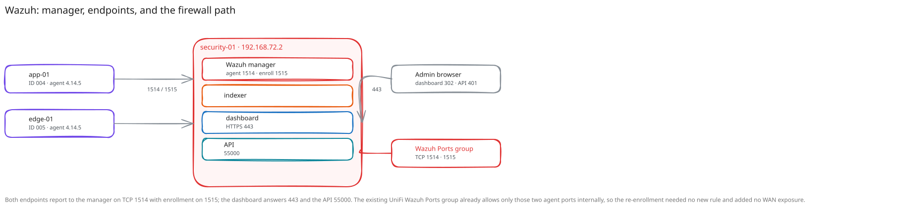

# Wazuh Walkthrough

**Created:** 2026-07-20  
**Last updated:** 2026-09-25

## What This Guide Covers

I run the Wazuh manager, indexer, dashboard, and API on the security host. This guide covers manager health, clean endpoint enrollment, network checks, dashboard confirmation, and endpoint retirement.

## Current Status and Verified Versions

The Wazuh 4.14.7 manager, indexer, and dashboard run on `security-01` (VM 200, `192.168.72.2`). The dashboard uses HTTPS 443, the API uses 55000, agent events use TCP 1514, and enrollment uses TCP 1515.

On 2026-09-24 `agent_control -l` listed 16 entries, all Active: the manager's own agent 000 and 15 remote agents. The remote agents are the five Proxmox nodes plus `app-01`, `edge-01`, `alpha-prod-01`, `docker-blue`, `media-01`, `ansible-01`, `monitor-01`, `docker-network`, `ubuntu-dev` and `docker-main`. `splunk-siem` has no agent. Game 01's agent left with that guest on 2026-09-12. The per-agent versions in the [Wazuh configuration reference](../Platforms/Wazuh/Configuration/README.md) are 4.14.6 on fourteen remote agents and 4.14.5 on `edge-01`.

Groups carry the file-integrity configuration: `default` on all 16, `proxmox` on the five nodes, `edge` on `edge-01`, and `workstation` on `ubuntu-dev`. Those groups and the forward into Splunk are covered in [Wazuh Alerts in Splunk](Wazuh-Alerts-in-Splunk.md).

## What You Need

- A working Wazuh manager, indexer, dashboard, and API.
- An endpoint supported by the manager version.
- TCP 1514 and 1515 from the endpoint to the manager.
- Administrative access to the endpoint and Wazuh dashboard.

## How the Pieces Fit Together



## Walkthrough

### Step 1: Check the Manager

I check all three units, the four expected listeners, dashboard response, API response, and current agent list before enrolling an endpoint.

```sh
systemctl is-active wazuh-manager wazuh-indexer wazuh-dashboard
ss -lnt | grep -E ':(443|1514|1515|55000)[[:space:]]'
curl -k -sS -o /dev/null -w '%{http_code}\n' https://127.0.0.1/
curl -k -sS -o /dev/null -w '%{http_code}\n' https://127.0.0.1:55000/
sudo /var/ossec/bin/agent_control -l
```

The expected unauthenticated responses are 302 from the dashboard and 401 from the API.

### Step 2: Remove a Stale Endpoint State

For a clean retry, I stop the endpoint agent, remove only its obsolete manager ID, uninstall the old package and `/var/ossec` state, and confirm the old ID no longer appears. I leave unrelated manager identities alone.

### Step 3: Install from the Dashboard Workflow

In Wazuh Dashboard, I open Agents management, choose Deploy new agent, select the endpoint platform, set the manager address to `192.168.72.2`, and run the generated endpoint installation command. I used this path for `app-01` and `edge-01`.

### Step 4: Start and Check the Agent

I enable the endpoint service, confirm it is active, and test TCP 1514 and 1515 to the manager. I then check that the ongoing session uses TCP 1514.

### Step 5: Confirm the Manager Identity

I refresh the Endpoints page and match the agent ID, hostname, address, package, cluster node, and Active state with the endpoint I just installed.


### Step 6: Verify the Existing Policy Path

I check that the internal UniFi rules still point to `192.168.72.2` and that the `Wazuh Ports` group contains only TCP 1514 and 1515. The recorded enrollment needed no new rule and added no WAN exposure.

### Step 7: Retire an Endpoint

I stop its agent, remove the exact current manager ID, purge endpoint state only when I intend a clean reinstall, and check the manager list again. I don't restore the retired IDs 002 or 003.

## What I Checked After Each Step

- Manager, indexer, and dashboard units were active.
- Ports 443, 55000, 1514, and 1515 were listening.
- Dashboard 302 and unauthenticated API 401 matched the expected healthy responses.
- On 2026-07-13, all 14 remote endpoint services then enrolled were enabled and active.
- On the same day, `app-01` ID 004 reported 4.14.6 and `edge-01` ID 005 reported 4.14.5 on `node01`.
- The existing internal firewall path allowed only the two Wazuh agent ports.

## Troubleshooting and Recovery

If an endpoint stays pending, compare its hostname and manager address, test TCP 1514 and 1515, inspect the endpoint service, and check the manager list for an older identity with the same name. For a clean retry, remove only the failed current identity and repeat the dashboard deployment workflow.

## Known Limits

The direct dashboard uses its existing self-signed certificate. NPM presents the internal wildcard certificate on the named client path. `edge-01` is one agent patch behind the rest of the fleet, per the configuration reference.

## Source Records

- [Wazuh overview](../Platforms/Wazuh/README.md)
- [Runbook, including recovery](../Platforms/Wazuh/Documentation/Runbook.md)
- [Endpoint removal](../Platforms/Wazuh/Documentation/Change%20Records/Endpoint%20Agent%20Removal%20-%202026-07-13.md)
- [Endpoint re-enrollment](../Platforms/Wazuh/Documentation/Change%20Records/Endpoint%20Re-enrollment%20-%202026-07-13.md)
- [Wazuh agent fleet deployment](../Platforms/Wazuh/Documentation/Change%20Records/Agent%20Fleet%20Deployment%20-%202026-08-03.md)
