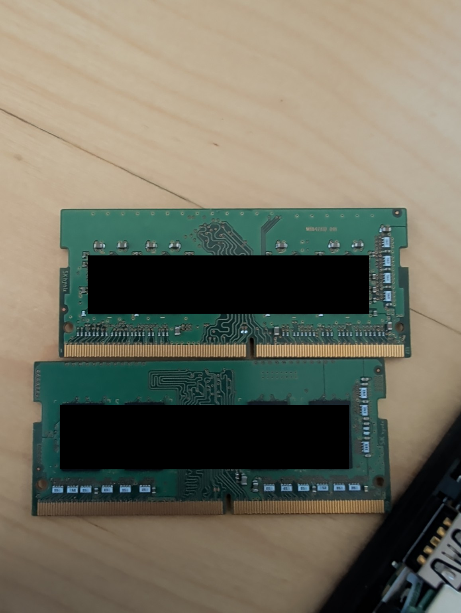

# Galaxy Node Spec Sheet

**Created:** 2026-07-08  
**Last updated:** 2026-07-20

These are the hardware specifications for my four Galaxy cluster nodes. I keep this sheet in sync with the live machines.

## Nodes
| Node | IP | CPU | Cores / Threads | Memory | GPU | Physical storage |
| --- | --- | --- | --- | --- | --- | --- |
| blue-server | 192.168.70.12 | Intel Core i5-7500T @ 2.70GHz | 4 / 4 | 11.57 GiB | Intel HD Graphics 630, integrated | 1x NVMe |
| grey-server | 192.168.70.10 | AMD Ryzen 7 3700X | 8 / 16 | 62.72 GiB | NVIDIA GeForce GTX 1080 Ti, discrete | 1x NVMe, 1x SSD, 1x HDD |
| purple-server | 192.168.70.11 | Intel Core i5-8500T @ 2.10GHz | 6 / 6 | 15.46 GiB | Intel UHD Graphics 630, integrated | 1x NVMe |
| red-server | 192.168.70.13 | Intel Core i5-8500T @ 2.10GHz | 6 / 6 | 15.46 GiB | Intel UHD Graphics 630, integrated | 1x NVMe |

## Physical Storage
| Node | Device | Type | Model | Size | Used by |
| --- | --- | --- | --- | --- | --- |
| blue-server | /dev/nvme0n1 | NVMe | SAMSUNG MZVLW256HEHP-000L7 | 238.47 GiB | BIOS boot |
| grey-server | /dev/nvme0n1 | NVMe | CT1000P310SSD8 | 931.51 GiB | BIOS boot |
| grey-server | /dev/sda | SSD | CT2000BX500SSD1 | 1.82 TiB | LVM |
| grey-server | /dev/sdb | HDD | TOSHIBA_DT01ACA200 | 1.82 TiB | ZFS |
| purple-server | /dev/nvme0n1 | NVMe | SAMSUNG MZVLB256HAHQ-000L7 | 238.47 GiB | BIOS boot |
| red-server | /dev/nvme0n1 | NVMe | SAMSUNG MZVLB256HAHQ-000L7 | 238.47 GiB | BIOS boot |

## Memory Modules

Two SK hynix SO-DIMM memory modules from the node hardware.
