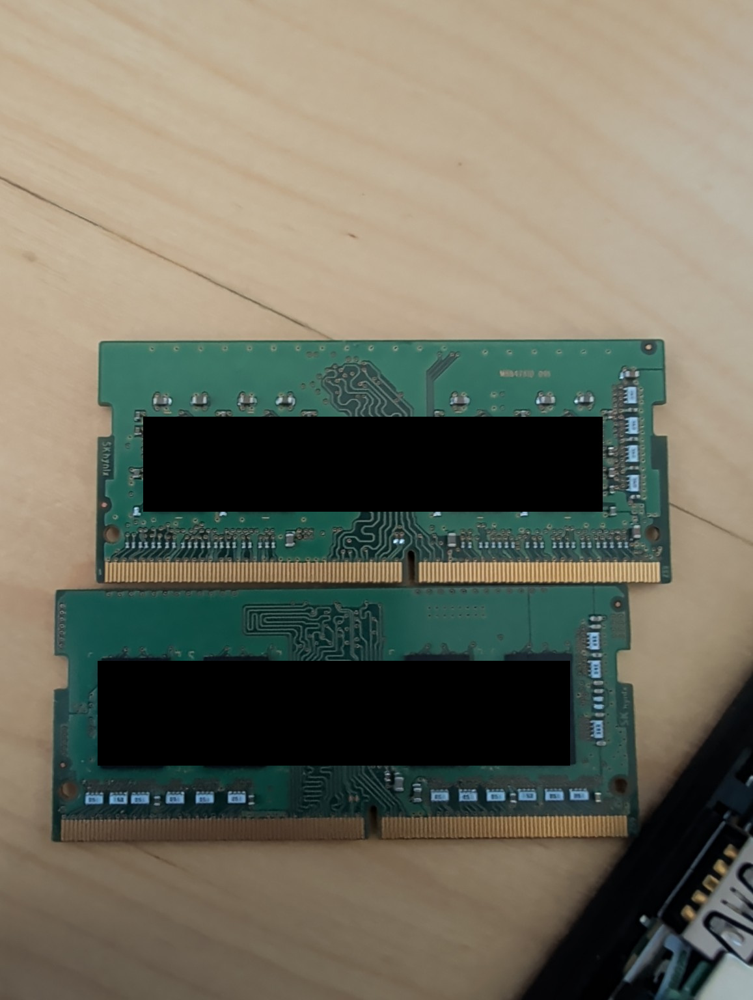

# Galaxy Node Spec Sheet

**Created:** 2026-07-08  
**Last updated:** 2026-07-27

I run Galaxy as four nodes with 24 physical CPU cores, 105.21 GiB of memory, four NVMe boot devices, two SATA SSDs, one 1.82 TiB ZFS disk, & one 931.51 GiB media HDD. I keep each model, capacity, management address, & reported UPS assignment separate.

## Nodes
| Node | IP | CPU | Cores / Threads | Memory | GPU | Physical storage | Power source |
| --- | --- | --- | --- | --- | --- | --- | --- |
| blue-server | 192.168.70.12 | Intel Core i5-7500T @ 2.70GHz | 4 / 4 | 11.57 GiB | Intel HD Graphics 630, integrated | 1x NVMe | [UPS-02](Power.md) |
| grey-server | 192.168.70.10 | AMD Ryzen 7 3700X | 8 / 16 | 62.72 GiB | NVIDIA GeForce GTX 1080 Ti, discrete | 1x NVMe, 1x SSD, 1x HDD | [UPS-02](Power.md) |
| purple-server | 192.168.70.11 | Intel Core i5-8500T @ 2.10GHz | 6 / 6 | 15.46 GiB | Intel UHD Graphics 630, integrated | 1x NVMe, 1x SSD | Not reported |
| red-server | 192.168.70.13 | Intel Core i5-8500T @ 2.10GHz | 6 / 6 | 15.46 GiB | Intel UHD Graphics 630, integrated | 1x NVMe, 1x HDD | [UPS-01; also reported on UPS-02](Power.md) |

## Physical Storage
| Node | Device | Type | Model | Size | Used by |
| --- | --- | --- | --- | --- | --- |
| blue-server | /dev/nvme0n1 | NVMe | SAMSUNG MZVLW256HEHP-000L7 | 238.47 GiB | BIOS boot |
| grey-server | /dev/nvme0n1 | NVMe | CT1000P310SSD8 | 931.51 GiB | BIOS boot |
| grey-server | /dev/sda | SSD | CT2000BX500SSD1 | 1.82 TiB | LVM |
| grey-server | /dev/sdb | HDD | TOSHIBA_DT01ACA200 | 1.82 TiB | ZFS |
| purple-server | /dev/nvme0n1 | NVMe | THNSF5256GPUK TOSHIBA | 238.47 GiB | BIOS boot |
| purple-server | /dev/sda | SSD | Samsung SSD 850 EVO 250GB | 232.89 GiB | Permanent general VM and LXC storage; configuration pending |
| red-server | /dev/nvme0n1 | NVMe | SAMSUNG MZVLB256HAHQ-000L7 | 238.47 GiB | BIOS boot |
| red-server | /dev/sda | HDD | ST1000LM035-1RK172 | 931.51 GiB | CT 842 `/data` through host ext4 bind mount |

Purple's boot device changed on 2026-07-25. The Samsung MZVLB256HAHQ-000L7 that shipped in it wore out at 169% of rated endurance, so I cloned it onto the Toshiba THNSF5256GPUK listed above & added the 850 EVO on the SATA port at the same time. On 2026-07-27 I assigned the 850 EVO a permanent role as general Proxmox storage for VM disks and LXC root volumes; the storage layout still needs to be configured. Both drives and the retired Samsung are in the [drive inventory](Components/Drives/README.md); the swap is written up in [Purple Boot NVMe Replacement](../Compute/Galaxy/Documentation/Change%20Records/Purple%20Boot%20NVMe%20Replacement%20-%202026-07-25.md).

## Memory Modules

The retained photo shows two SK hynix SO-DIMM modules from the node hardware.
