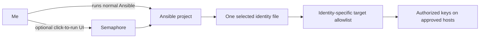
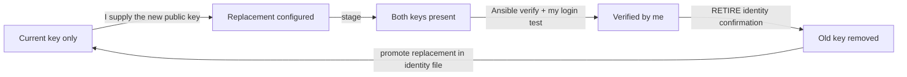

# SSH Identity Automation Architecture

**Created:** 2026-07-14  
**Last updated:** 2026-07-18

## The Simple Version

Each device that can initiate SSH (Mac, Ansible Control, Jedi PC, or Termix) has one identity file. That file names its current public key and the machines where it is allowed. The playbooks operate on one selected identity at a time, so rotating Jedi PC never replaces the Mac, Ansible Control, or Termix keys.

Semaphore stores the controller's execution credential and launches the same playbooks. It does not contain a second automation implementation, and the repository contains no private keys.

## Identity Separation

| Identity | File | What a run may change |
|---|---|---|
| Mac | `identities/mac.yml` | Only the exact Mac key |
| Ansible Control | `identities/ansible-control.yml` | Only the exact Ansible Control key |
| Jedi PC | `identities/jedi-pc.yml` | Only the exact Jedi PC key |
| Termix | `identities/termix.yml` | Only the exact Termix key |

Comments such as `jedi-pc` are labels. Exact comparison and removal use the key algorithm plus encoded public-key material, so renaming a comment does not create a different cryptographic key.

## Rotation State Machine

The removal gate stays closed unless all of these are true:

- a distinct replacement public key is configured;
- both old and replacement keys are present on every selected target;
- I have tested the replacement from the owner device and set `operator_verified: true`;
- the exact `RETIRE <identity-id>` phrase is supplied;
- every selected target is reachable.

## Privilege Model

The controller does not use sudo for this workflow. It logs in as the account that owns the key file (`root`, `REDACTED_USER_001`, `openclaw`, `REDACTED_DEPLOYMENT_USER`, or Windows `Administrator`) and edits only that account's authorized-key store. I set it up this way to avoid interactive sudo passwords and to avoid adding another passwordless-sudo dependency solely for key rotation.

The four Proxmox nodes share `/etc/pve/priv/authorized_keys`. `grey-server` is the sole writer; `purple-server`, `blue-server`, and `red-server` verify the cluster-backed result without performing duplicate writes.

## Runtime and Boot Model

Ansible is a command-line runtime, not a continuously running daemon. The current upstream release lives in `/opt/ansible-14.2.0`, and `/opt/ansible-current` selects it. The `ansible`, `ansible-community`, and `ansible-playbook` commands in `/usr/local/bin` resolve into that selected runtime. Debian's older packaged Ansible remains installed as a rollback fallback.

Semaphore is the continuously running part. The systemd unit at `/etc/systemd/system/semaphore.service`, mirrored in `Configuration/semaphore.service`, starts the UI with `/opt/ansible-current/bin` first in `PATH`, the required `C.utf8` locale, automatic restart on failure, and a restrictive file-creation mask.

This gives the web UI automatic recovery after a controller or Proxmox-node boot. Direct Ansible commands need no service and are available as soon as the LXC is running.

## Scope Boundaries

- `ws-dc-2-secondary` and `obi-pc` remain in `ssh_key_unknown`; the playbooks cannot select them.
- `nas-family` is retired and is absent from the inventory and validator.
- Private keys remain on their owner device or in Semaphore's encrypted Key Store.
- I generate replacement keys on the owner device; Ansible stages, verifies, and retires public keys only.
