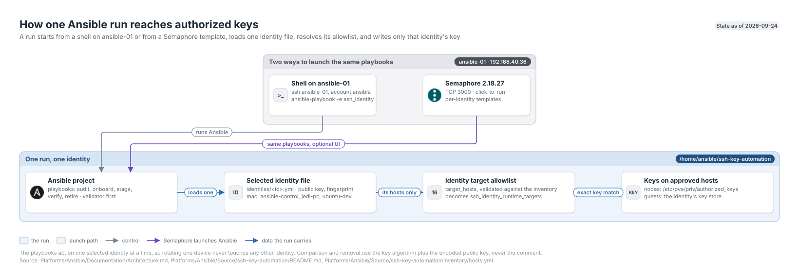
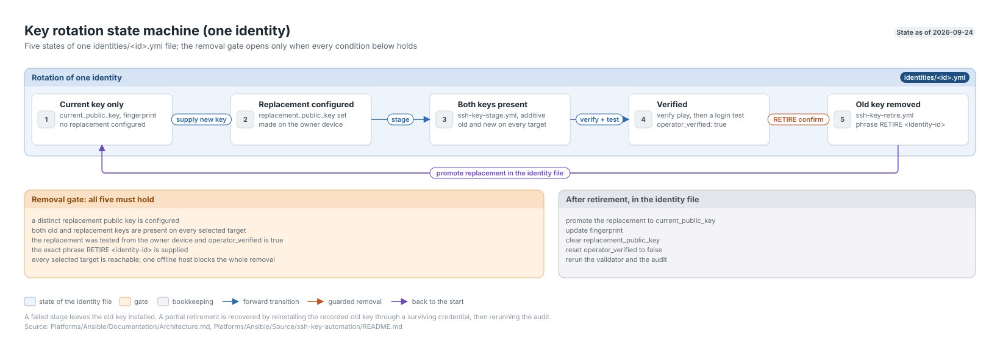
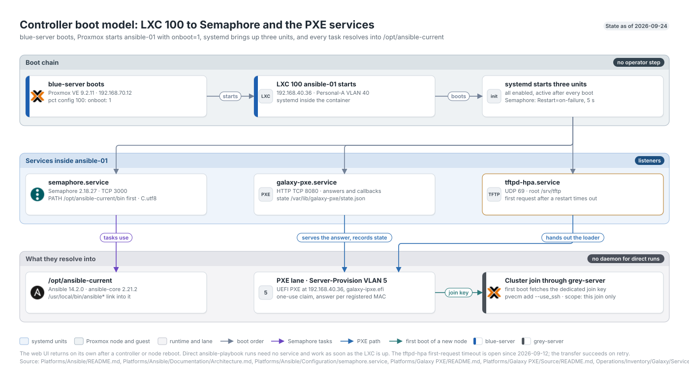

# Ansible Architecture

**Created:** 2026-07-14  
**Last updated:** 2026-09-25

## Request Path

Each device that can initiate SSH (Mac, Ansible Control, Jedi PC or Ubuntu Dev) has one identity file. That file names its current public key and the machines where it is allowed. The playbooks operate on one selected identity at a time, so rotating Jedi PC never replaces another identity's key.

Semaphore launches the same playbooks through a web interface. It doesn't contain a second automation implementation. Each project directory carries a manifest that describes its Semaphore project. Live Semaphore held three projects and 23 templates on 2026-09-24; the four manifests in the repository describe 41 templates, and the difference is listed in the [README](../README.md).

| Semaphore project | Controller directory | Managed scope |
|---|---|---|
| `Server-SSH` | `/home/ansible/ssh-key-automation` | SSH identity audit, onboarding, staging, verification and retirement on 16 hosts |
| `Fleet-Updates` | `/home/ansible/fleet-updates` | OS package maintenance on 11 guests and 20 Compose projects on 6 hosts |
| `Monitoring-Exporters` | `/home/ansible/monitoring-exporters` | node_exporter on 9 inventory hosts (one of them the decommissioned `db-13-dev`), cAdvisor on 8 Docker hosts; the manifest adds textfile collectors on 6 hosts and What's Up Docker on 6 |
| `Host-Access-Baseline` (manifest only) | `/home/ansible/host-access-baseline` | `ai-agent` account on 10 guests, account passwords and sudo policy |

Each project has its own repository, inventory, `C.utf8` environment, views, templates, and project-scoped copy of the controller SSH credential. `/opt/homelab/ansible-tools/reconcile_semaphore.py` compares every managed field with the manifests I pass it and reports drift without writing unless I supply `--apply`. It retains unmanaged objects by default; `--prune` deletes only absent templates and views.

## Identity Separation

| Identity | File | What a run may change |
|---|---|---|
| Mac | `identities/mac.yml` | Only the exact Mac key |
| Ansible Control | `identities/ansible-control.yml` | Only the exact Ansible Control key |
| Jedi PC | `identities/jedi-pc.yml` | Only the exact Jedi PC key |
| Ubuntu Dev | `identities/ubuntu-dev.yml` | Only the exact Ubuntu Dev key |

Comments such as `jedi-pc` are labels. Exact comparison and removal use the key algorithm plus encoded public-key material, so renaming a comment does not create a different cryptographic key.

## Rotation State Machine

The removal gate stays closed unless all of these are true:

- a distinct replacement public key is configured;
- both old and replacement keys are present on every selected target;
- I have tested the replacement from the device that owns the identity and set `operator_verified: true`;
- the exact `RETIRE <identity-id>` phrase is supplied;
- every selected target is reachable.

## Privilege Model

Ten remote guests in the fleet-update scope use the dedicated `ansible` account for controller access. That account has a validated `NOPASSWD: ALL` rule, so the controller can update packages and manage another account's authorized-key file without storing a sudo password in Ansible. `ansible-01` joins the 11-host package-update scope through Ansible's local connection. Its controller key is restricted to connections from `192.168.40.36` and disables agent forwarding, port forwarding, X11 forwarding, and PTY allocation.

Each identity may override the POSIX account and authorized-keys path. `ansible-control` resolves to `/home/ansible/.ssh/authorized_keys`; Mac, Jedi PC, and the other human identities keep the original `root` or administrative-user key stores. Read, add, and remove operations become root only when the selected key store belongs to a different account than the SSH connection.

The five Proxmox nodes share `/etc/pve/priv/authorized_keys`. `grey-server` is the sole writer; `purple-server`, `blue-server`, `red-server` and `green-server` verify the cluster-backed result without performing duplicate writes.

## Runtime and Boot Model

Ansible is a command-line runtime, not a continuously running daemon. The current upstream release lives in `/opt/ansible-14.2.0`, and `/opt/ansible-current` selects it. The `ansible`, `ansible-community`, and `ansible-playbook` commands in `/usr/local/bin` resolve into that selected runtime. Debian's older packaged Ansible remains installed as a rollback fallback.

Semaphore is the continuously running part. The systemd unit at `/etc/systemd/system/semaphore.service`, mirrored in `Configuration/semaphore.service`, starts the UI with `/opt/ansible-current/bin` first in `PATH`, the required `C.utf8` locale, automatic restart on failure, and a restrictive file-creation mask.

This gives the web UI automatic recovery after a controller or Proxmox-node boot. Direct Ansible commands need no service and are available as soon as the LXC is running.

## Hosts Outside Automation

- I removed the retired domain controllers and `obi-pc` from the deployed and repository inventories on 2026-07-27. No Windows host remains in this automation.
- `nas-family` is retired and is absent from the inventory and validator.
- Stopped guests remain in the general SSH-key inventory only when an existing identity record still references them. They aren't targets of the active fleet update playbooks.
- The fleet-update playbooks don't target `grey-server`, `purple-server`, `blue-server`, `red-server` or `green-server`. Proxmox node maintenance remains a separate operation.
- I generate replacements on the device that owns the identity. Ansible stages, checks, and retires the public-key entries.
