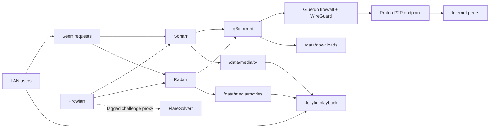

# Media Stack Architecture Overview

**Created:** 2026-07-17  
**Last updated:** 2026-07-18

## Purpose

I separate user-facing media workflows from download egress. Jellyfin, Seerr, Sonarr, Radarr, Prowlarr, and FlareSolverr use the guest's ordinary VLAN path. Only qBittorrent shares Gluetun's network namespace and therefore exits through Proton VPN.

## Resource and Device Model

I run CT 842 unprivileged, starting with the Proxmox node, on local LVM storage on `red-server`. It receives `/dev/dri/renderD128` for Jellyfin Intel Quick Sync and `/dev/net/tun` for the VPN tunnel. The guest has 4 vCPU, 8 GiB memory, 1 GiB swap, and a 100 GiB root volume.

Because the volume is node-local and the guest is not HA-managed, recovery depends on protected backups or restoration on `red-server`; automatic cross-node storage failover is not available.
