# Media Stack Application Onboarding Evidence

**Created:** 2026-07-17  
**Last updated:** 2026-07-21

**Capture window:** 2026-07-17, 20:08–21:14 EDT  
**Mechanism:** Walkthrough I performed in a workstation browser against the LAN management interfaces of CT 842 `media-01`

I performed the onboarding in each application's web UI. The 16 screenshots below cover the saved settings; S13 is the one step without a capture.

**S01:** Jellyfin's guided setup running with server name `Jelly-Media` and English display language.

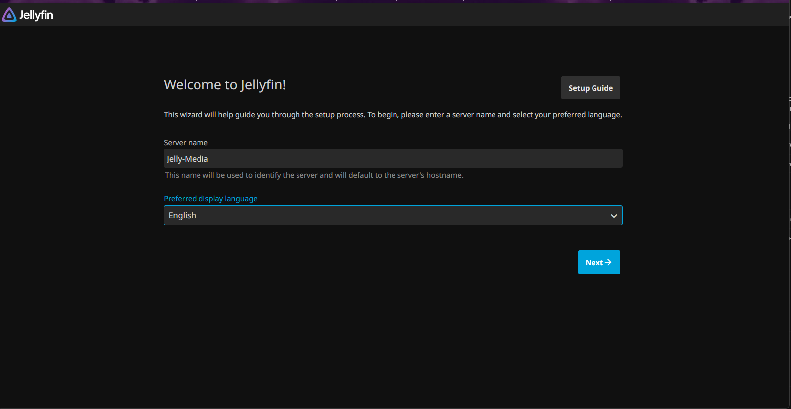

**S02:** `Movies` library (content type Movies) created enabled with English/United States metadata defaults and real-time monitoring; the folder picker is collapsed in the capture.

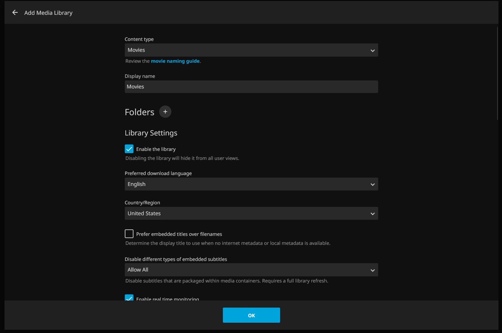

**S03:** `TV Shows` library (content type Shows) created enabled with English/United States defaults and `Specials` season naming; the folder picker is collapsed in the capture.

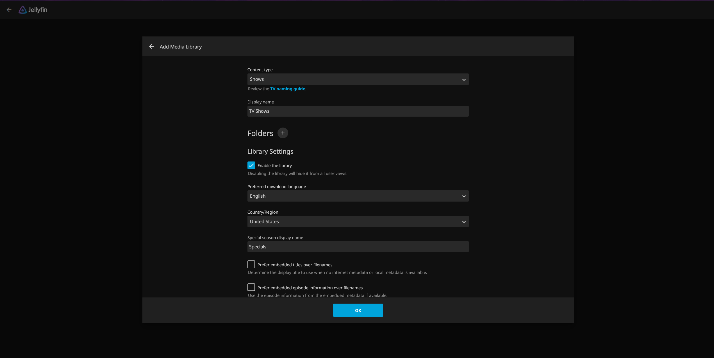

**S04:** Web UI reachable on the LAN address with an empty queue, existing `radarr` and `tv-sonarr` categories, 85.35 GiB free space, and DHT idle at zero nodes behind the VPN.

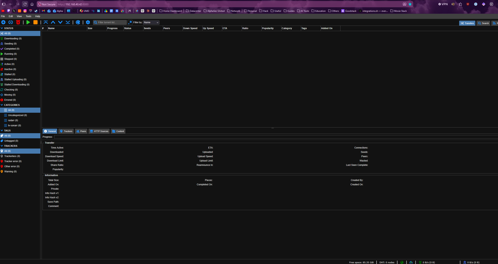

**S05:** Intel QuickSync selected with a blank device field; hardware decoding enabled for H264, HEVC, MPEG2, VC1, VP8, VP9, HEVC 10-bit, and VP9 10-bit with AV1 and both HEVC RExt profiles off; OS-native VA-API decoders preferred; hardware encoding on with both Low-Power encoders off; HEVC output allowed. Tone-mapping fields sit below the captured viewport.

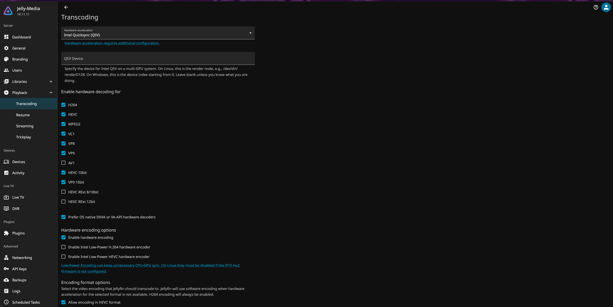

**S06:** Episode renaming with Smart Replace; standard, daily, and anime formats retaining `{Quality Full}`; season folders `Season {season}`; specials folder `Specials`; prefixed-range multi-episode style.

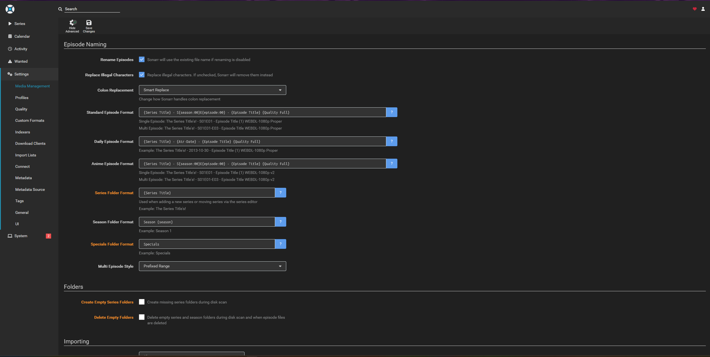

**S07:** Television root folder `/data/media/tv` with 85.4 GiB free and zero unmapped folders; recycling bin unset with 7-day cleanup; permission rewriting off.

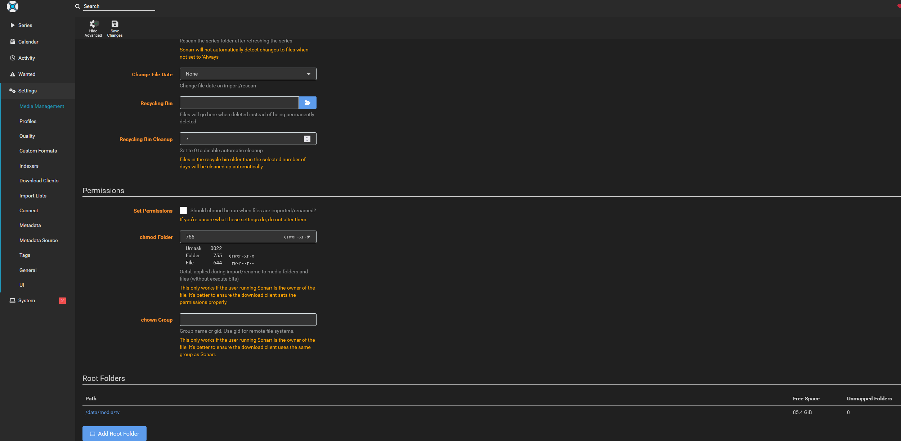

**S08:** `qBittorrent via Proton VPN` client enabled with completed-download handling and failed-download redownload on; no remote path mappings.

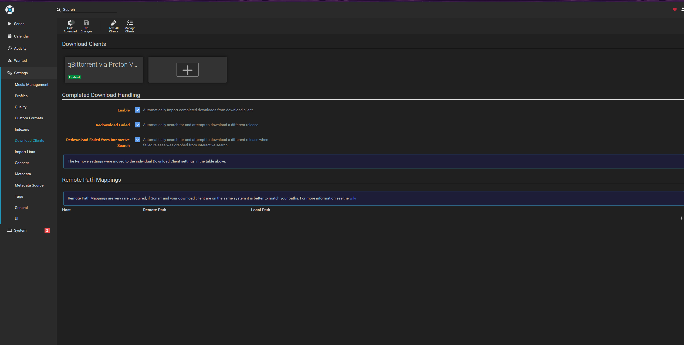

**S09:** Movie renaming `{Movie Title} ({Release Year}) {Quality Full}`; hard-links-instead-of-copy enabled; 100 MB minimum-free-space import guard.

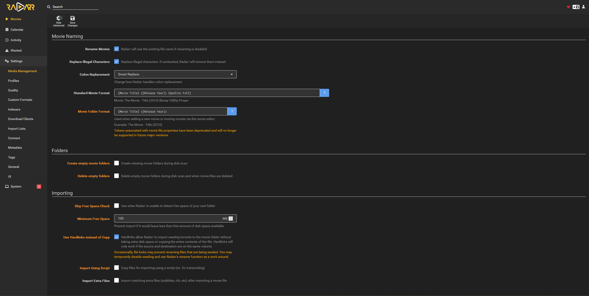

**S10:** Movie root folder `/data/media/movies` with 85.4 GiB free and zero unmapped folders.

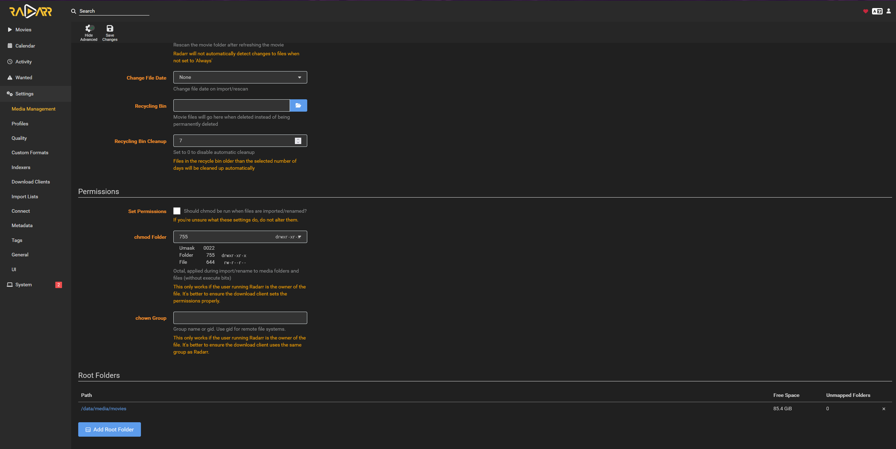

**S11:** Six stock quality profiles with the default delay profile and no release profiles.

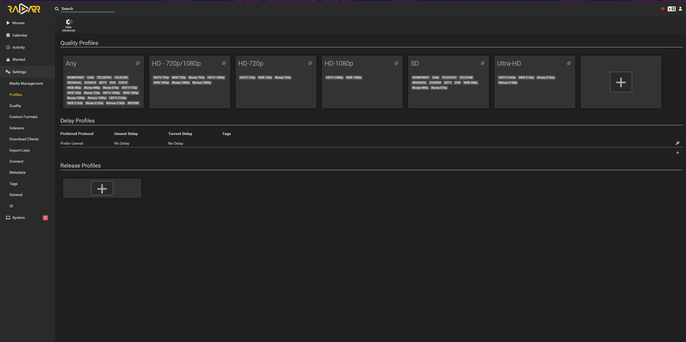

**S12:** Download client entry pointing at host `gluetun` port 8080 with category `radarr`; the Docker-subnet path is documented in the [configuration reference](../../Configuration/README.md).

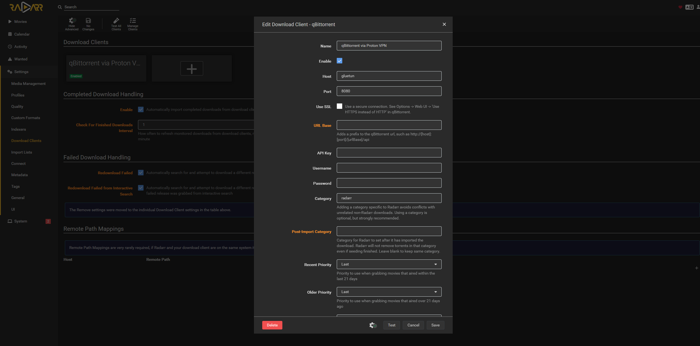

**S13:** Screenshot not retained. I kept no capture for the Prowlarr indexer addition. The addition itself, one enabled public torrent indexer at priority 25 with the Standard sync profile, added 20:55, with no `flaresolverr` tag because the indexer does not require challenge handling, is recorded in the change record without retained evidence.

**S14:** Seerr setup wizard connected to Jellyfin with the Movies and TV Shows libraries synced and enabled.

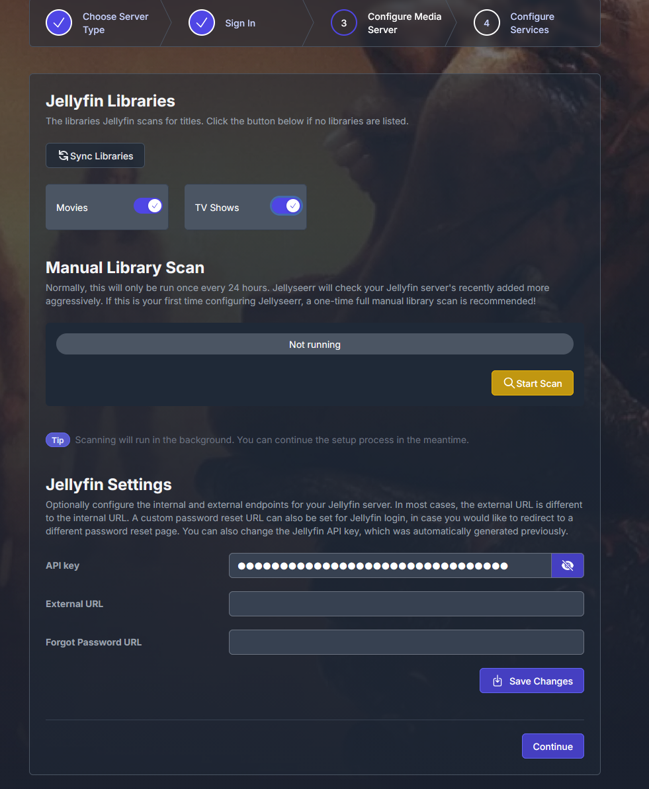

**S15:** "Radarr connection established successfully" with Radarr as default server: host `radarr` port 7878, HD-1080p profile, root `/data/media/movies`, minimum availability Released, scan and automatic search enabled.

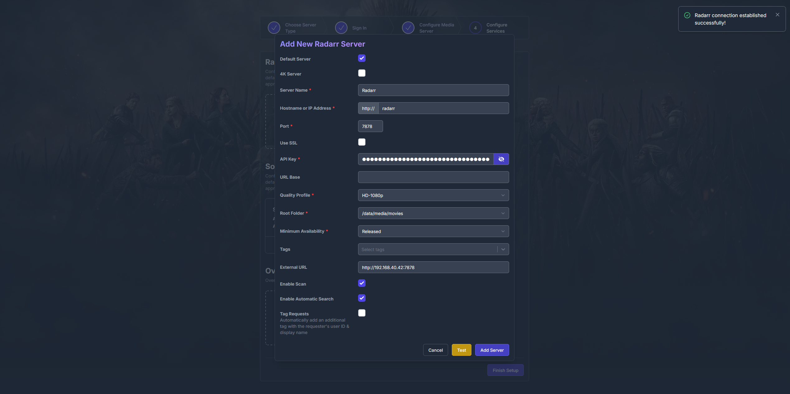

**S16:** Sonarr as default server: host `sonarr` port 8989, HD-1080p profile for standard and anime series, root `/data/media/tv`, season folders on, scan and automatic search enabled.

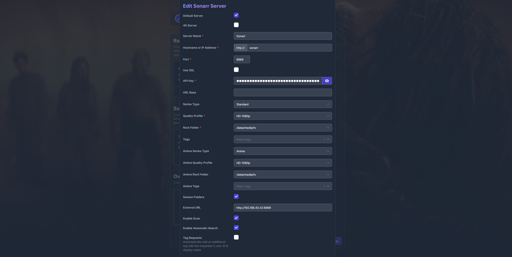

**S17:** The migrated request UI rendering populated Discover metadata after wizard completion, confirming the post-migration interface is functional.

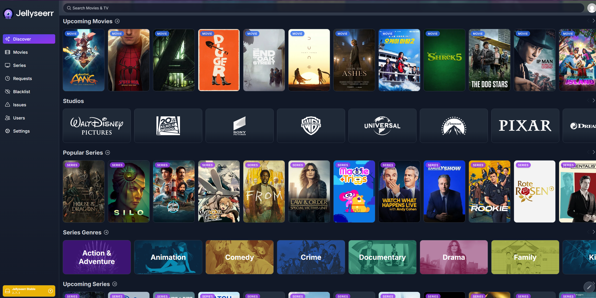

This set does not cover the bounded end-to-end acquisition test. That test ran on 2026-07-21: a requested movie was acquired through the stack and plays in the Jellyfin Movies library. Because the capture shows an acquired title, it is retained locally under `Evidence/Media Stack End-to-End Acquisition Test - 2026-07-21/` rather than published here. The remaining end-to-end checks are tracked in the [platform TODO](../../Documentation/TODO.md).
