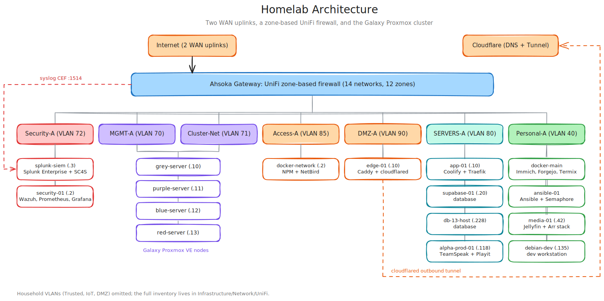

# My Homelab

**Created:** 2026-07-09  
**Last updated:** 2026-07-18

This is the working repository for my homelab. I run a four-node Proxmox cluster ("Galaxy") behind a zone-segmented UniFi network, with a Splunk SIEM and Wazuh watching the environment from a dedicated security VLAN. Everything I build, break, and fix here gets written down: build logs with the reasoning behind each decision, dated change records with step evidence, per-system troubleshooting logs, and incident reports. This repo is those records, published in redacted form.

## Contents

- [Lab architecture](#lab-architecture)
- [Repository layout](#repository-layout)
- [Selected records](#selected-records)
- [How I document](#how-i-document)
- [Redaction and secrets](#redaction-and-secrets)
- [Roadmap](#roadmap)

## Lab architecture

Traffic enters through two WAN uplinks (plus Cloudflare Tunnel for published services, so nothing requires an inbound port forward). The UniFi gateway enforces zone-based firewall policy across 14 networks in 12 firewall zones: infrastructure tiers with an `-A` suffix each live in their own custom zone under least-privilege rules, separate from the household networks. The Galaxy cluster (grey, purple, blue, and red servers) hosts the workloads; UniFi exports CEF syslog to the Splunk SIEM on Security-A, and every node and endpoint reports to Wazuh and Prometheus on the same VLAN.

## Repository layout

Records live with the system that owns or enforces them. Deployed services are self-contained under `Platforms/`, and evidence sits beside the work that produced it.

| Category | What it holds | Example |
|---|---|---|
| [Governance](Governance/README.md) | My documentation standard, naming conventions, and audits | [Documentation Standard](Governance/Documentation-Standard.md) |
| [Architecture](Architecture/README.md) | Environment-wide designs and research | [Persistent remote development research](Architecture/Remote-AI-Development-Research-2026-07-12.md) |
| [Infrastructure](Infrastructure/README.md) | Network, compute cluster, and physical hardware | [Galaxy cluster](Infrastructure/Compute/Galaxy/README.md) |
| [Platforms](Platforms/README.md) | Deployed services with their docs, config, and source | [Splunk SIEM build log](Platforms/Splunk/Splunk%20Enterprise/Documentation/Build-Log.md) |
| [Engineering](Engineering/README.md) | Shared automation and pre-deployment projects | Currently empty by design |
| [Operations](Operations/README.md) | Cross-system inventories and maintenance records | [Galaxy inventory](Operations/Inventory/Galaxy/Galaxy%20Inventory.md) |
| [Security](Security/README.md) | Incident reports, hardening standards, assessments | [Linux host baseline](Security/Hardening/Linux-Host-Baseline-Standard.md) |
| [Archive](Archive/README.md) | Superseded records kept for history | Currently empty by design |

## Selected records

The writeups I would show first, each with the thing it proves:

| Record | What it covers |
|---|---|
| [Splunk SIEM build log](Platforms/Splunk/Splunk%20Enterprise/Documentation/Build-Log.md) | Bare VM to a working CEF ingestion pipeline (SC4S in front of Splunk), with the reasoning at every fork and 41 build screenshots |
| [Security-A migration](Infrastructure/Network/UniFi/Documentation/Change%20Records/Security-A%20Migration%20-%202026-07-12.md) | Moved the SIEM and monitoring stack to their own VLAN 72 zone with zero new WAN-inbound exposure |
| [Galaxy Corosync link addition](Infrastructure/Compute/Galaxy/Documentation/Change%20Records/Galaxy%20Cluster-Net%20Corosync%20Link%20Addition%20-%202026-07-10.md) | Added a redundant cluster interconnect across all four nodes, verified with a full link-failure mesh test |
| [Credential rotation incident response](Security/Incidents/security-incident-response-2026-04-19.md) | My response to the April 2026 Vercel disclosure: full credential rotation and access review on the exposed project |
| [TeamSpeak UDP relay outage](Security/Incidents/TeamSpeak-Incident-Report-2026-04-24-UDP-Relay-Outage.md) | Root-caused a voice outage to Docker's UDP port proxy and rebuilt the container network path |
| [NetBird routed VPN path](Platforms/Netbird/Documentation/Change%20Records/NetBird%20First%20Peer%20and%20Routed%20VPN%20Path%20-%202026-07-12.md) | First WireGuard mesh peer with a routed path into the Access-A VLAN, evidenced step by step |
| [SSH authorized-key cleanup](Operations/Maintenance/SSH%20Authorized%20Key%20Cleanup%20-%202026-07-14.md) | Normalized 15 hosts to a three-key fleet baseline and moved five private identities into 1Password custody |

## How I document

Every bounded project closes with a dated change record: scope, steps, observed results, verification, and rollback points. Problems go to the owning system's troubleshooting log as symptom, root cause, fix, and verification; anything service-impacting becomes an incident report under `Security/Incidents/`. Living documents (READMEs, runbooks, inventories) keep stable filenames and a `Last updated` date; point-in-time records keep their date in the filename. The full rules are in my [Documentation Standard](Governance/Documentation-Standard.md).

## Redaction and secrets

Secret values never enter this repository. Credentials live in 1Password and are referenced, never embedded. Private identifiers (domains, org names, some usernames) appear as stable `REDACTED_*` placeholders so repeated references stay readable across records. Raw step evidence that contains identifying detail stays offline; the screenshots published here are the redaction-safe subset.

## Roadmap

Current priorities from my [central TODO](TODO.md):

1. Lock down MGMT-A per the [network segmentation plan](Infrastructure/Network/UniFi/Documentation/Change%20Plans/Network-Segmentation-TODO.md).
2. Run the media stack's bounded end-to-end acquisition test, then its backup and capacity work.
3. Give the SIEM a proper domain name and put a reverse proxy with a CA-signed certificate in front of Splunk Web.
4. Continue Splunk ES data readiness: scope the CIM data models to the indexes in use.
