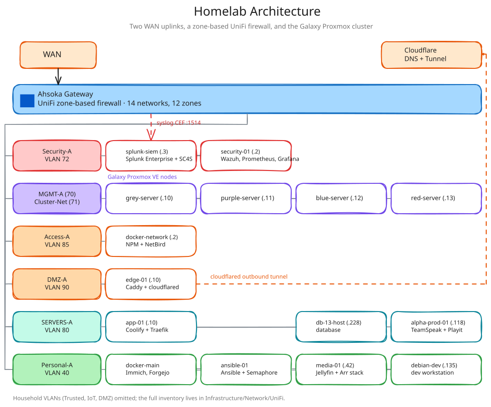

# My Homelab

**Created:** 2026-07-09  
**Last updated:** 2026-08-04

This repository documents my five-node Proxmox cluster, segmented UniFi network, deployed platforms, automation, monitoring, & security work. The [walkthrough guides](Guides/README.md) are the quickest way to follow a build from its first command to the checks I ran afterward.

## Version figures

A version figure in this repository is a point-in-time observation, not a durable fact. I give it an observation or verification date in the same record. A dated event or snapshot field already supplies that date, so I do not repeat it after every figure in that record.

## Start Here

- [Guides](Guides/README.md): chronological walkthroughs with commands, screenshots, checks, recovery notes, & links to the original records.
- [Lab architecture](#lab-architecture): the environment in one view.
- [Repository layout](#repository-layout): where the detailed records and configuration live.
- [Build and change records](#build-and-change-records): longer records for several completed projects.
- [Roadmap](#roadmap): the current work queue.

## Lab architecture

Traffic enters through two WAN uplinks. Cloudflare Tunnel carries the published HTTP services without an inbound port forward. The UniFi gateway holds 28 network objects, including 20 routed LAN networks, and enforces policy across 16 zones. The Galaxy cluster hosts the workloads; UniFi sends CEF events to Splunk on Security-A, Wazuh reports 14 active remote agents, & Prometheus reports 49 targets `UP` across six jobs.

## Repository layout

The guides provide the reading path. Detailed records stay with the system that owns the work, and screenshots remain beside the change that produced them.

| Category | What it holds | Example |
|---|---|---|
| [Guides](Guides/README.md) | Visitor walkthroughs across infrastructure and platforms | [Galaxy Proxmox Cluster](Guides/Galaxy-Proxmox-Cluster.md) |
| [Architecture](Architecture/README.md) | Environment-wide designs and research | [Persistent remote development research](Architecture/Remote-AI-Development-Research-2026-07-12.md) |
| [Infrastructure](Infrastructure/README.md) | Network, compute cluster, and physical hardware | [Galaxy cluster](Infrastructure/Compute/Galaxy/README.md) |
| [Platforms](Platforms/README.md) | Deployed services with their docs, config, and source | [Splunk Enterprise build log](Platforms/Splunk/Enterprise/Documentation/Build-Log.md) |
| [Engineering](Engineering/README.md) | Shared automation and pre-deployment projects | [Preview server](Engineering/Preview%20Server/README.md) |
| [Operations](Operations/README.md) | Cross-system inventories and maintenance records | [Galaxy inventory](Operations/Inventory/Galaxy/Galaxy%20Inventory.md) |
| [Security](Security/README.md) | Incident reports and assessments | [UniFi firewall audit](Security/Assessments/UniFi%20Firewall%20Audit%20-%202026-07-27.md) |
| [Backups](Backups/README.md) | Config files copied off a host before an edit | [How a file gets here](Backups/README.md#how-a-file-gets-here) |
| [Archive](Archive/README.md) | Superseded records kept for history | [Retired ai-alpha-01 record](Archive/Operations/Inventory/Galaxy/AI%20Alpha%2001%20Retired%20Guest%20-%202026-07-25.md) |

## Build and Change Records

| Record | What it covers |
|---|---|
| [Splunk Enterprise build log](Platforms/Splunk/Enterprise/Documentation/Build-Log.md) | Rocky Linux VM, Splunk Enterprise 10.4.0, HEC, SC4S, UniFi CEF ingestion, `netops` routing, & 40 screenshots |
| [Security-A migration](Infrastructure/Network/UniFi/Documentation/Change%20Records/Security-A%20Migration%20-%202026-07-12.md) | VLAN 72, the Security-A zone, address changes, firewall policy, service moves, & post-migration checks |
| [Galaxy Corosync link addition](Infrastructure/Compute/Galaxy/Documentation/Change%20Records/Galaxy%20Cluster-Net%20Corosync%20Link%20Addition%20-%202026-07-10.md) | VLAN 71 interfaces, Corosync `link1`, four-node rollout, quorum checks, & link-failure tests |
| [April 2026 incident response](Security/Incidents/Vercel/Credential%20Rotation%20After%20Vendor%20Bulletin%20-%202026-04-19.md) | Review, containment, corrective actions, service validation, & closure after the Vercel disclosure |
| [TeamSpeak UDP relay outage](Security/Incidents/Teamspeak/UDP%20Relay%20Outage%20-%202026-04-24.md) | UDP relay symptoms, Docker proxy diagnosis, network-path rebuild, & voice checks |
| [NetBird routed VPN path](Platforms/Netbird/Documentation/Change%20Records/NetBird%20First%20Peer%20and%20Routed%20VPN%20Path%20-%202026-07-12.md) | First peer enrollment, routed resource, access policy, routing peer, masquerade, & HTTPS tunnel test |
| [SSH authorized-key cleanup](Operations/Maintenance/SSH%20Authorized%20Key%20Cleanup%20-%202026-07-14.md) | Nineteen-host inventory, 15 reachable targets, fingerprint comparison, authorized-key cleanup, & final access checks |

## Roadmap

Current priorities from my [central TODO](TODO.md):

1. Add the automated thin-pool warning in the [Kasm storage backlog](Platforms/Kasm%20Workspaces/Documentation/TODO.md). The manual 80 percent capacity gate remains in force until the alert exists.
2. Delete stopped Galaxy CT 105 `ai-bravo-02` and its root volume on 2026-08-15 after completing the [Galaxy deletion checklist](Infrastructure/Compute/Galaxy/Documentation/TODO.md).
