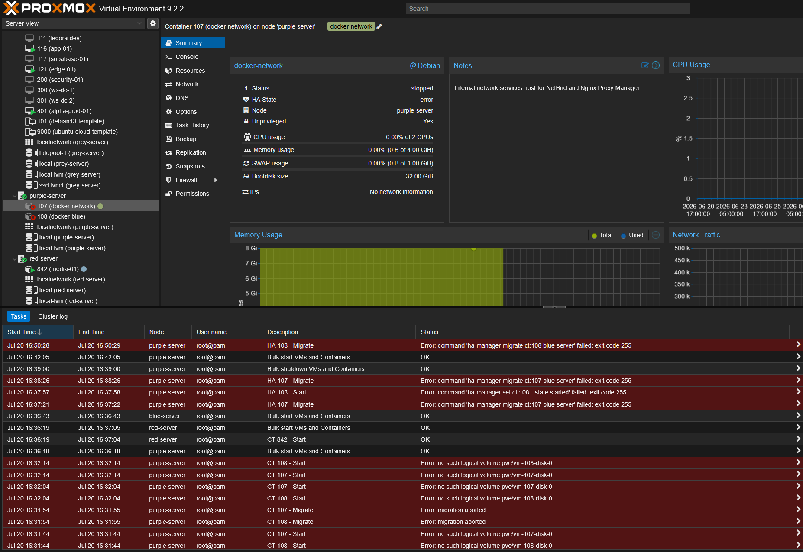
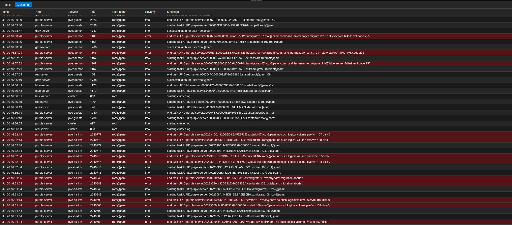
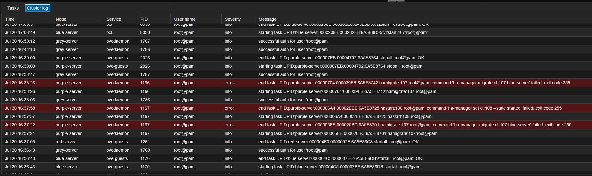
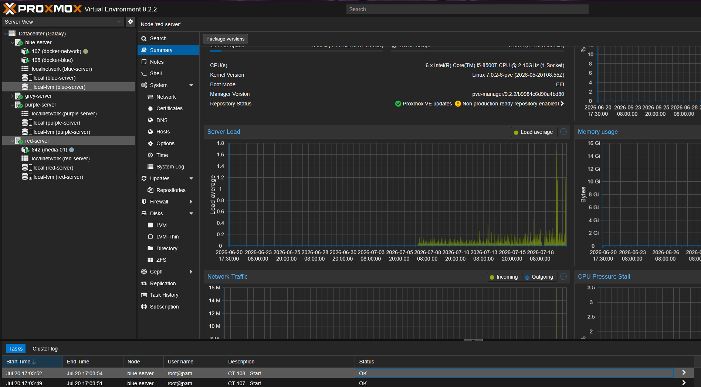

# Galaxy HA Local-Storage Stranding Incident - 2026-07-20

**Created:** 2026-07-20  
**Last updated:** 2026-07-22

## Incident Metadata

| Field | Value |
|-------|-------|
| Incident ID | GLXY-INC-2026-07-20-001 |
| Report Date | 2026-07-20 |
| Report Timezone | America/New_York (EDT) |
| Environment | Production |
| Service | Galaxy Proxmox HA (CT 107 `docker-network`, CT 108 `docker-blue`) |
| Home node | blue-server (192.168.70.12) |
| Cluster | Galaxy, 4 nodes, quorate throughout |
| Trigger | Planned maintenance: moving blue, purple, red, & grey onto a UPS |
| Status | Resolved |
| Severity | SEV-2 - Service Outage |

## Incident Summary

A planned maintenance shutdown of `blue-server` at 16:30 EDT took two HA-managed containers offline and the HA manager couldn't bring either one back. I was moving blue, purple, red, & grey onto a UPS, so blue went down on purpose. CT 107 `docker-network` (NetBird control plane & Nginx Proxy Manager) and CT 108 `docker-blue` (the RustDesk relay containers `hbbs` & `hbbr`) were both down for about 33 minutes, from 16:30 to 17:03 EDT.

Both containers put their root disk on `local-lvm`, which is node-local LVM-thin storage in each node's `pve` volume group. It isn't shared. blue's HA LRM logged `got shutdown request with shutdown policy 'conditional'`, so the manager relocated the two resource configs to `purple-server`, but the disks stayed on blue. Purple had no `pve/vm-107-disk-0` or `pve/vm-108-disk-0`, so every start attempt failed with `no such logical volume`, and the HA manager parked both services in the `error` state. Migrating them back with `ha-manager migrate ct:107 blue-server` returned exit code 255 each time, because the task refused a service already in `error`: `service 'ct:107' in error state, must be disabled and fixed first`.

The data was never at risk. The containers were stopped cleanly at 16:30 and never ran anywhere else, so blue's disks held the latest state. I removed both from HA to clear the error, moved each config back to blue where its disk lived, started them, verified the workloads, then pinned both to blue-server with a strict HA node-affinity rule so the relocation can't happen on the next maintenance window.

## Impact Assessment

| Area | Impact |
|------|--------|
| CT 107 `docker-network` | NetBird control plane & Nginx Proxy Manager offline from 16:30 to 17:03 EDT. Internal reverse-proxy hosts and the NetBird management/signal path were unreachable during the window. |
| CT 108 `docker-blue` | RustDesk relay (`hbbs` ID/rendezvous & `hbbr` relay) offline for the same window. |
| Cluster | Galaxy stayed quorate with all 4 nodes reporting. media-01 (CT 842) rode the maintenance on red and came back on its own. |
| Data loss | None. Both root disks stayed intact on blue-server at their recorded 32 GiB & 15 GiB sizes; the containers shut down cleanly before the node went down. |
| Security exposure | None observed. The two config files moved only between node directories inside the cluster filesystem; no external access & no config edits beyond the recovery. |

## Affected Assets

| Asset | Role | Observed State |
|-------|------|----------------|
| blue-server | Home node for CT 107/108; holds their `local-lvm` disks | Shut down 16:30-16:36, back online 16:36 |
| purple-server | Node the HA manager relocated the configs to | Online; had the configs but no disks |
| red-server | HA CRM master | Online; drove the failed recovery attempts |
| CT 107 `docker-network` | NetBird + Nginx Proxy Manager host | Stranded (config on purple, disk on blue), recovered on blue |
| CT 108 `docker-blue` | RustDesk relay host | Stranded, recovered on blue |
| `pve/vm-107-disk-0` | CT 107 root disk, 32 GiB | Intact on blue, inactive during the incident |
| `pve/vm-108-disk-0` | CT 108 root disk, 15 GiB | Intact on blue, inactive during the incident |

## Timeline (EDT)

| Time | Event |
|------|-------|
| 16:22 | blue-server booted (an earlier step of the same UPS maintenance) |
| 16:30:12 | blue's `pve-guests` ran `stopall`; all VMs & CTs on blue stopped cleanly |
| 16:30:14 | blue's HA LRM logged `got shutdown request with shutdown policy 'conditional'` then `shutdown LRM, stop all services` |
| 16:30:24 | blue's LRM stopped `ct:107` & `ct:108` (`vzshutdown` tasks) |
| 16:30-16:36 | blue offline for the UPS move; the CRM relocated both configs to purple-server |
| 16:31:34-16:32:14 | purple's HA LRM `vzstart` for 107 & 108 failed repeatedly: `no such logical volume pve/vm-107-disk-0` |
| 16:31:55 | HA-driven `vzmigrate` of 107 & 108 aborted with `found stale volume copy on node 'red-server'` |
| 16:36 | blue booted and rejoined; its disks were back, but the configs were stuck on purple |
| 16:37:21-16:50:28 | My GUI recovery attempts (`hamigrate`, `hastart`, a bulk shutdown/start) all failed; the HA tasks returned exit 255 with `service in error state, must be disabled and fixed first` |
| 17:03:49-17:03:54 | Both containers started on blue after the manual fix (`vzstart:107` & `vzstart:108` returned `TASK OK`) |
| ~17:06 | Re-added both to HA and applied the strict blue-server pin rule |

## Technical Findings

### Finding 1 - HA relocated the configs on a shutdown because the policy is `conditional`

`datacenter.cfg` carries no `ha:` line, so the HA `shutdown_policy` is the default `conditional`. Under `conditional`, a node reboot freezes its HA services until the node returns, but a node shutdown relocates them to another node. blue's `last` log shows `shutdown system down Mon Jul 20 16:30 - 16:36`, an actual power-down for the UPS move rather than a reboot, and blue's LRM logged the policy by name at 16:30:14. The shutdown told the CRM to move 107 & 108 off blue.

```text
Jul 20 16:30:14 blue-server pve-ha-lrm[1278]: got shutdown request with shutdown policy 'conditional'
Jul 20 16:30:14 blue-server pve-ha-lrm[1278]: shutdown LRM, stop all services
Jul 20 16:30:24 blue-server pve-ha-lrm[6501]: stopping service ct:107
Jul 20 16:30:24 blue-server pve-ha-lrm[6502]: stopping service ct:108
```

Full excerpt: [blue-shutdown-conditional-policy-journal-2026-07-20.txt](Evidence/Logs/blue-shutdown-conditional-policy-journal-2026-07-20.txt).

### Finding 2 - The disks couldn't follow because `local-lvm` is node-local

`storage.cfg` defines `local-lvm` as `lvmthin thinpool data vgname pve` with no `nodes` restriction, so every node has a `pve/data` pool, but each pool is separate node-local storage rather than one shared volume. The cluster has no shared block storage reachable by blue, purple, or red; the only non-local pools, `ssd-lvm1` & `hddpool-1`, are restricted to grey-server. So purple received the configs but had nothing to start:

```text
task started by HA resource agent
TASK ERROR: no such logical volume pve/vm-107-disk-0
```

The stranding was visible in the Proxmox UI: CT 107 sat `stopped` with HA State `error` on purple-server, reporting `No network information`.



The cluster log shows the full `pve-ha-lrm` cascade: `vzstart` failing with `no such logical volume` and `vzmigrate` returning `migration aborted`.



### Finding 3 - The migrate-back failed because the service was already in `error`

An HA service in the `error` state won't accept a migrate or start command until it's disabled and fixed. Every `ha-manager migrate ct:107 blue-server` I ran returned exit 255 for that reason, not because of anything wrong with blue:

```text
Requesting HA migration for CT 107 to node blue-server
service 'ct:107' in error state, must be disabled and fixed first
TASK ERROR: command 'ha-manager migrate ct:107 blue-server' failed: exit code 255
```



Full task transcripts: [purple-ha-recovery-attempt-failures-2026-07-20.txt](Evidence/Logs/purple-ha-recovery-attempt-failures-2026-07-20.txt) and [purple-vzmigrate-aborted-2026-07-20.txt](Evidence/Logs/purple-vzmigrate-aborted-2026-07-20.txt).

## Root Cause Analysis

### Primary root cause

CT 107 & 108 are HA-managed on node-local `local-lvm` in a cluster with no shared storage reachable by more than one of blue, purple, or red. An HA relocation of these guests can move the config but never the disk, so any event that relocates them off blue strands the config on a diskless node. This exposure was accepted at build time; the [Docker-Network LXC deployment record](../../../Infrastructure/Compute/Galaxy/Documentation/Change%20Records/Galaxy%20Docker-Network%20LXC%20Deployment%20-%202026-07-10.md) states: "The HA resource is backed by node-local `local-lvm`. I accepted that this starts and monitors the guest but doesn't provide shared-storage failover to another node."

### Trigger

Planned maintenance: I was moving blue, purple, red, & grey onto a UPS and shut blue down as part of that work. Because the HA `shutdown_policy` is the default `conditional`, the shutdown relocated the two services instead of freezing them. A reboot would have frozen them and returned them to blue; a full power-down relocated them.

### Why the manual fix failed first

`ha-manager migrate` and `ha-manager set --state started` both refuse a service in the `error` state, so my GUI recovery attempts between 16:37 and 16:50 returned exit 255 without ever touching blue. The service had to leave HA management before the config could move.

### Ruled out

- Data corruption or loss: blue's disks were intact at 32 GiB & 15 GiB and mounted cleanly on start.
- Fencing: blue shut its HA services down cleanly under `stopall` and was never fenced; no watchdog reset occurred.
- Cluster quorum loss: Corosync reported all 4 nodes and quorate throughout.
- blue-server instability: this was a deliberate power-down for the UPS move, unrelated to the [recurring `pvestatd` crashes](../../../Infrastructure/Compute/Galaxy/Documentation/Troubleshooting/Recurring%20pvestatd%20Failure%20on%20blue-server%20-%202026-07-13.md) tracked separately.
- Stale disk copies as a blocker: the `stale volume copy on red-server` noted in the migrate log was already gone by the time I inspected red; only `vm-842-disk-0` remained there.

## Corrective Actions Completed

| Action | Status | Notes |
|--------|--------|-------|
| Confirmed disk location & integrity | Complete | `vm-107-disk-0` (32 GiB) & `vm-108-disk-0` (15 GiB) present on blue's `pve/data`, inactive |
| Removed both resources from HA | Complete | `ha-manager remove ct:107` & `ct:108`, both rc 0; cleared the `error` state |
| Moved configs back to blue | Complete | `mv /etc/pve/nodes/purple-server/lxc/{107,108}.conf` to `blue-server/lxc/`; purple dir emptied |
| Started both on blue | Complete | `pct start 107` & `108`; task logs returned `TASK OK` at 17:03:49-17:03:54; disks reactivated (`Vwi-aotz--`) |
| Verified CT 107 workloads | Complete | SSH reached 192.168.85.2; `netbird-server`, `netbird-dashboard` up, `nginx-proxy-manager` healthy |
| Verified CT 108 workloads | Complete | 192.168.40.39/24 up, gateway reachable, `hbbs` & `hbbr` running |
| Re-added both to HA | Complete | `ha-manager add ct:107 --state started` & `ct:108`, both adopted `started` on blue |
| Pinned both to blue-server | Complete | Strict node-affinity rule `pin-blue-local-storage` covering `ct:107,ct:108`, `--nodes blue-server --strict 1` |

## Validation Evidence

Both containers run on blue-server, HA state `started`, and the strict node-affinity rule blocks relocation to any node that can't reach their disks. Captured at 17:15:26 EDT:

```text
service ct:107 (blue-server, started)
service ct:108 (blue-server, started)

node-affinity: pin-blue-local-storage
	comment 107/108 use node-local local-lvm; no shared storage for failover, pin to blue
	nodes blue-server
	resources ct:107,ct:108
	strict 1
```

The Proxmox UI confirms both containers back under blue-server and both start tasks returning OK.



Full snapshot: [post-recovery-verification-2026-07-20.txt](Evidence/Logs/post-recovery-verification-2026-07-20.txt). The evidence set is cataloged in the [Evidence Index](Evidence/Evidence-Index.md).

With the strict pin in place, a future blue shutdown or reboot leaves 107 & 108 stopped until blue returns, then they auto-start on blue. That's the correct behavior while their storage is node-local: the HA manager can no longer strand the config on a diskless node.

## Follow-Up Controls

1. Keep the `pin-blue-local-storage` rule while 107 & 108 stay on `local-lvm`. Removing it re-enables the stranding path.
2. With the pin in place, a future blue shutdown or reboot leaves 107 & 108 stopped until blue rejoins, then they auto-start on blue. The HA manager no longer relocates them to another node, which is the intended behavior while their storage is node-local.
3. If real failover for these services is ever wanted, it needs shared storage (Ceph or NFS) reachable by more than one node. None exists today; the pin is the correct posture until that changes.
4. Before powering a node down for maintenance, confirm any HA guest on that node is either on shared storage or pinned to it, so future node moves don't strand a guest again.

## Related Records

- [Galaxy HA local-storage troubleshooting record](../../../Infrastructure/Compute/Galaxy/Documentation/Troubleshooting/HA%20Local-Storage%20Stranding%20of%20CT%20107%20and%20CT%20108%20After%20a%20Blue-Server%20Shutdown%20-%202026-07-20.md)
- [Galaxy Docker-Network LXC Deployment](../../../Infrastructure/Compute/Galaxy/Documentation/Change%20Records/Galaxy%20Docker-Network%20LXC%20Deployment%20-%202026-07-10.md)
- [Galaxy LXC inventory](../../../Operations/Inventory/Galaxy/LXCs.md)
- [Evidence Index](Evidence/Evidence-Index.md)
